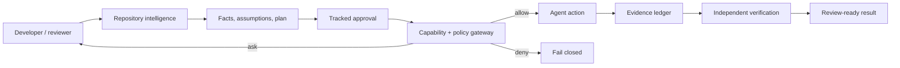

# AI Agent Kit — Governed AI Coding Agents for Claude Code and Codex

[](https://www.npmjs.com/package/@hunpeolabs/ai-agent-kit)
[](https://github.com/phamhungptithcm/ai-agent-kit/actions/workflows/npm-publish.yml)
[](LICENSE)
[](package.json)

**Turn Claude Code and OpenAI Codex into a consistent engineering system—not a collection of disconnected prompts.**

One command installs shared rules, repository context, quality checks, approval gates, workflows, and reviewable evidence.

```bash
npx --yes @hunpeolabs/ai-agent-kit@latest bootstrap
```

[Quick start](#quick-start) · [How it works](#how-it-works) · [Documentation](#documentation) · [npm](https://www.npmjs.com/package/@hunpeolabs/ai-agent-kit)


## Why It Matters

AI assistants can drift: one skips tests, another misses repository conventions, and another expands scope without approval.

AI Agent Kit gives the team one durable workflow:

```text
Understand → Inspect repository → Plan → Approve → Execute → Verify → Review
```

- **Developers:** repository-aware plans and reusable workflows.
- **Tech leads:** explicit assumptions, bounded scope, and review evidence.
- **QA and security:** consistent profiles, safety rules, and verification.
- **Managers:** one operating model across supported agents.

## Core Capabilities

| Capability | What it changes for the user |
| --- | --- |
| Shared policy | Claude Code and Codex follow the same rules and workflows. |
| Repository intelligence | CodeGraph and CocoIndex ground analysis in current code and docs. |
| Quality profiles | Reviews adapt to stack, domain, security, and runtime risks. |
| Governed changes | Tracked approval and command policy bound implementation. |
| Adaptive runtime | Goals, facts, assumptions, plans, capabilities, and budgets stay explicit. |
| Reviewable evidence | Receipts, verification, approved memory, and evals support review. |

## Quick Start

Run inside a Git repository:

```bash
# Inspect every planned file first
npx --yes @hunpeolabs/ai-agent-kit@latest bootstrap --dry-run

# Install the complete governed contract
npx --yes @hunpeolabs/ai-agent-kit@latest bootstrap --preset governed
```

Then inspect readiness and choose a workflow:

```bash
npx --yes @hunpeolabs/ai-agent-kit@latest doctor
npx --yes @hunpeolabs/ai-agent-kit@latest prompts
```

Bootstrap is local. It does not edit application source, commit, push, open a pull request, update a ticket, or deploy.

## Use Cases

- **Legacy modernization:** inspect impact before editing.
- **Pull-request review:** apply one quality and security contract.
- **Feature delivery:** turn repository facts into an approved plan.
- **Incident investigation:** separate observations, assumptions, and evidence.
- **Onboarding:** install one shared AI engineering workflow.
- **Public websites:** compose SEO/GEO, design, accessibility, and motion guidance.

## Works With

| Status | Agent | Adapter |
| --- | --- | --- |
| **Shipped** | Claude Code | `CLAUDE.md`, config, commands, roles, hooks, and generated skills. |
| **Shipped** | OpenAI Codex | `AGENTS.md`, config, rules, roles, hooks, and generated skills. |
| **Roadmap** | Copilot, Cursor, Windsurf, Gemini CLI | Thin adapters that preserve the same `.ai/` contract. |
| **Research** | Amazon Q, Junie, Cline, Devin, Aider, Continue | Candidate instruction, skill, and workflow surfaces. |

Roadmap entries are not shipped support. See [Agent Adapter Strategy](docs/AGENT_ADAPTER_STRATEGY.md).

## How It Compares

| Capability | Prompt or tool-specific rules | AI Agent Kit |
| --- | ---: | ---: |
| Shared Claude Code/Codex policy | Partial | Built in |
| Repository-intelligence gate | Manual | Built in |
| Stack-aware quality profiles | Manual | Included |
| Approval and action boundaries | Manual | Enforced |
| Evidence and independent verification | Agent-dependent | Included |

This compares operating models, not model intelligence.

## What Gets Installed

```text
.ai/                    shared source of truth
├── rules/              engineering, security, testing, SEO/GEO, design
├── quality-profiles/   language, platform, API, DB, concurrency, memory
├── skills-src/         reusable engineering skills
├── workflows/          plan, implement, review, incident, delivery
├── prompts/            purpose-named task starters
├── templates/          approval, evidence, review, design, handoff
├── guards/             policy, risk, capability, dependency, secrets
└── evals/              golden and behavioral regression cases

.claude/                Claude Code adapter
.codex/ + .agents/      OpenAI Codex adapter
AGENTS.md + CLAUDE.md   shared-policy entry points
```

## How It Works



Guidance supports reasoning; deterministic controls authorize protected actions. Runtime data stays local and excludes prompts, raw source/output, secrets, and chain-of-thought.

## What Is New In 0.4.0

Version `0.4.0` focuses on adoption and discoverability:

- a shorter, outcome-led README designed for GitHub and npm readers;
- a proof-oriented bootstrap demo;
- clearer shipped-versus-roadmap support;
- provenance-correct release history;
- focused package description and search keywords.

The governed runtime and its safety/evidence capabilities arrived in `0.3.0` and remain available.

<details>
<summary><strong>Release highlights: 0.1.0 → 0.4.0</strong></summary>

### 0.1.0 — Foundation

- Local bootstrap for Claude Code and Codex.
- Enterprise scaffold, repository-intelligence checks, backups, rollback, and CI publishing.

### 0.2.0 — Quality And Lifecycle

- Stack-aware quality profiles plus SEO/GEO, visual-design, and motion workflows.
- Read-only lifecycle inspection, ownership protection, adapter isolation, and packed smoke tests.

### 0.3.0 — Governed Agent Runtime

- Approval-to-diff enforcement, protected-edit hooks, and deterministic command policy.
- Scoped task runtime, adaptive plans, evidence receipts, approved memory, telemetry, evals, and SPDX SBOM.

### 0.4.0 — Adoption And Discoverability

- Conversion-first README, real demo asset, clearer positioning, release provenance, and focused search metadata.

</details>

See the complete [Changelog](CHANGELOG.md).

## Safety By Default

- Critical autonomous operations remain forbidden.
- Protected actions return `allow`, `ask`, or `deny`.
- Bootstrap writes only governed configuration and local metadata.
- Tool installation is separated into read-only planning and explicit apply.
- Lifecycle update and uninstall remain preview-only.
- No hosted control plane or model-provider credential is required.

## Documentation

- **Try it with a team:** [Adoption Guide](docs/ADOPTION_GUIDE.md)
- **Understand the architecture:** [High-Level Design](docs/HIGH_LEVEL_DESIGN.md)
- **Review runtime boundaries:** [Governed Runtime V1 Plan](docs/GOVERNED_RUNTIME_V1_PLAN.md)
- **Add another agent:** [Agent Adapter Strategy](docs/AGENT_ADAPTER_STRATEGY.md)
- **Understand quality selection:** [Code Quality Intelligence](docs/CODE_QUALITY_INTELLIGENCE.md)
- **Prepare a release:** [Public Launch Checklist](docs/PUBLIC_LAUNCH_CHECKLIST.md)
- **Report or contribute:** [Security](SECURITY.md) · [Contributing](CONTRIBUTING.md)

## Local Development

```bash
npm ci
npm run check
npm run release:dry-run
```

## Help Shape The Project

If reviewable AI engineering is useful to your team:

- ⭐ star the repository to follow releases;
- 💡 open an issue for the workflow or agent surface you need;
- 🧪 contribute a sanitized failing behavioral case;
- 🔐 never include proprietary source, credentials, or secrets.

The goal is not maximum autonomy. It is dependable AI-assisted engineering: better context, consistent workflows, bounded action, and evidence a human can review.

## License

[MIT](LICENSE)
