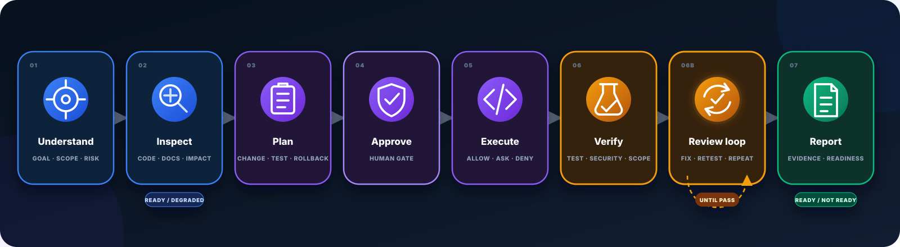
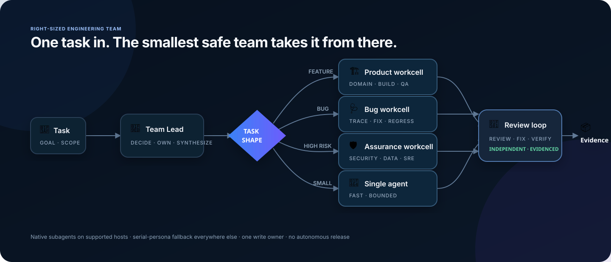

# AI Agent Kit — Governed AI Coding Agents

[](https://www.npmjs.com/package/@hunpeolabs/ai-agent-kit)
[](https://www.npmjs.com/package/@hunpeolabs/ai-agent-kit)
[](https://github.com/phamhungptithcm/ai-agent-kit/stargazers)
[](https://github.com/phamhungptithcm/ai-agent-kit/actions/workflows/npm-publish.yml)
[](LICENSE)
[](package.json)

Give every AI coding agent the same way to understand a repository, plan a
change, coordinate specialist subagents, work within approval boundaries, and
show what it actually verified.

AI Agent Kit is an open-source governance and orchestration layer for Claude
Code, Codex, Copilot, Cursor, and eight other coding agents. It combines
repository intelligence, multi-agent coordination, system design, quality
profiles, approval gates, and reviewable evidence in one local workflow.

```bash
# Codex only
npx --yes @hunpeolabs/ai-agent-kit@latest bootstrap --agents codex

# Claude Code only
npx --yes @hunpeolabs/ai-agent-kit@latest bootstrap --agents claude
```

Bootstrap is local. It does not edit application code, commit, push, open a
pull request, update a ticket, or deploy.

[What it does](#what-it-does) · [Install](#install-for-the-agents-you-use) · [Everything included](#whats-included) · [Supported agents](#supported-agents) · [Documentation](#documentation) · [npm](https://www.npmjs.com/package/@hunpeolabs/ai-agent-kit)


## Why use it?

Coding agents are useful, but each one can approach the same repository
differently. Important context gets missed, plans drift from implementation,
and a confident answer can look more complete than the evidence supports.

AI Agent Kit gives them the same path:

```text
Understand → Inspect → Plan → Approve → Execute → Verify → Report
```

| Rules or prompts alone | AI Agent Kit |
| --- | --- |
| Instructions are available if the agent remembers to use them | The task workflow selects the relevant context, rules, and quality profiles |
| Approval lives in conversation history | Approval is tied to the task, repository state, scope, and protected action |
| “Done” may describe intent or local output | Completion reports separate verified work, missing evidence, and remaining risk |
| Optional indexing can become a blocker | CodeGraph and CocoIndex fall back to bounded `DEGRADED` repository inspection |

The kit does not decide what your team should approve. It makes the boundary
clear, keeps normal work moving, and leaves evidence another person can review.

See the complete loop without touching a real project:

```bash
npx --yes @hunpeolabs/ai-agent-kit@latest demo
```

The command creates a private, offline Agent Proof Replay with the plan,
approval, policy decisions, verification, review fixes, and final readiness in
one page. It includes no source, prompts, secrets, or raw logs.

## What it does

AI Agent Kit gives coding agents a shared engineering system instead of a
different set of instructions for every tool.

| Your agent can | How the kit helps |
| --- | --- |
| **Understand the repository** | Builds task-specific context from source, docs, ownership, architecture, CodeGraph, and CocoIndex. Missing optional indexes fall back to bounded native inspection instead of blocking work. |
| **Plan before changing code** | Maps impact, risk, preserved behavior, tests, rollback, and exact paths, then waits for approval when the change requires it. |
| **Bring in the right specialists** | Chooses a solo, product, bug, or assurance workcell. Shared claims and handoffs stop subagents from duplicating work or editing over one another. |
| **Design for real constraints** | Turns latency, traffic, concurrency, reliability, security, regions, and budget into capacity math, architecture options, cost evidence, and migration triggers. |
| **Build against the actual stack** | Selects quality profiles for the language, framework, web, mobile, desktop, API, database, infrastructure, security, testing, SEO/GEO, design, motion, and marketing work in scope. |
| **Review until the change is clean** | Checks requirements, failure paths, security, error handling, code quality, and trade-offs. Findings return to the implementation owner for another fix and review cycle. |
| **Prove what happened** | Produces final task reports, PR evidence, offline Agent Proof Replay, Failure Lab results, signed Change Passports, and evidence-backed readiness blockers. |
| **Keep humans in control** | Binds tools, paths, domains, actions, policies, and approvals to the task. Commit, push, deploy, release, messaging, spending, and other protected actions stay separately authorized. |

If this workflow helps your agents do better engineering work, consider
[starring the repository](https://github.com/phamhungptithcm/ai-agent-kit). It
helps other developers find the project.

## What's included

### Repository-aware workflow

- CodeGraph for structure and impact analysis.
- CocoIndex for semantic search across code and documentation.
- A bounded `DEGRADED` fallback when either index is unavailable.
- Task-specific context packs with sources, selection reasons, token budgets,
  and deterministic hashes.
- Ready-made workflows for planning, implementation, bug fixes, reviews,
  incidents, architecture, security, testing, releases, and handoff.

### Code quality

- Profiles for Go, Java, Python, TypeScript/JavaScript, and HTML/CSS.
- Web, mobile, desktop, infrastructure, and DevOps guidance.
- API, database, concurrency, memory, security, observability, dependency, and
  testing checks.
- Automatic profile selection based on the repository's language, framework,
  platform, and risk.

### System design from real constraints

Describe the outcome in normal language—latency, traffic, concurrent users,
security, reliability, regions, and budget. The agent turns it into measurable
requirements, inspects the current system, calculates capacity, and recommends
the smallest architecture with a clear path to the target scale.

```text
Requirements → Capacity → Options → Cost → Risks → Recommendation
```

- Keeps RPS, active users, open connections, and in-flight requests distinct.
- Uses percentile-based latency and explicit availability, RTO, RPO,
  consistency, durability, and data boundaries.
- Calculates concurrency, bandwidth, storage growth, headroom, and evidenced
  replica needs with a deterministic model.
- Looks up AWS, Google Cloud, or Azure catalog prices only when provider,
  region, and service dimensions are known; snapshots are hashed and cached,
  while unavailable pricing never becomes zero.
- Generates approval-bound benchmark plans, imports measured results, and
  keeps calculated capacity separate from unproven instance throughput.
- Produces a local architecture evidence pack with an offline visual report,
  traceability, tamper detection, repository-staleness checks, and diffs.
- Applies workload playbooks for APIs, realtime, streams, batch, media,
  search, AI/RAG, multi-tenant SaaS, and payment ledgers.
- Compares launch, target, and justified extreme-scale stages without forcing
  premature Kubernetes, microservices, partitioning, or multi-region writes.
- Stops at `READY_FOR_REVIEW`; architecture alone is never production proof.

```bash
ai-agent-kit architecture start --goal "Design a secure API for 1M RPS" \
  --peak-rps 1000000 --latency-ms 900 --provider aws --region us-east-1
ai-agent-kit architecture status
ai-agent-kit architecture validate --file request.json
ai-agent-kit architecture model --file request.json --tested-safe-rps 500
ai-agent-kit architecture build --file design.json
ai-agent-kit architecture verify --file .ai-agent-kit/architecture/designs/ARCH-1/architecture.json
```

`architecture start` creates the normalized request and shows no more than
three architecture-changing questions plus copy-ready next commands. Use
`architecture quick` for the same guidance without writing a file. A pricing
snapshot can be attached to `architecture model` with `--pricing-snapshot` and
`--monthly-quantity`; missing pricing remains unavailable rather than zero.

### Writing quality

- A `humanize-writing` skill for natural voice editing across posts, blogs,
  emails, and personal or marketing drafts.
- Task-local voice mirroring, a model-language pattern dictionary, and
  meaning-preserving rules for facts, attribution, authorship, and privacy.
- No fabricated experiences or specificity, and no claims that a rewrite can
  prove human authorship or bypass AI detectors.

### Website growth, end to end

The kit helps an agent understand what the website needs to say, build it well,
and measure what happens next.

```text
Context → Positioning → Page → SEO/GEO → Design & motion → Measure → Improve
```

- Marketing context, message match, funnels, landing pages, CTAs, attribution,
  and safe experiments.
- A claim ledger that keeps assumptions, missing proof, and invented customer
  stories out of public content.
- SEO and GEO rules for metadata, canonical URLs, structured data, hreflang,
  crawl policy, raw HTML, and evidence-backed public claims.
- Design and animation guidance that works with the existing system and keeps
  accessibility, performance, reduced motion, and content intact.
- Measurement plans with clear metrics, consent, privacy, source of truth, and
  an honest `NOT_MEASURED` result when evidence is missing.

Add the complete workflow to your repository:

```bash
npx --yes @hunpeolabs/ai-agent-kit@latest bootstrap
```

### Governance and safety



AI Agent Kit gives every coding agent the same path:

**Understand → Inspect → Plan → Approve → Execute → Verify → Report**

Inside Verify, the agent repeats review → fix → verify until a fresh review
passes. Release actions always require separate authorization.

- Existing-system changes stop for a reviewed impact plan and explicit approval.
- Protected edits are checked against the approved paths and current diff.
- Command policy separates safe, review-required, and forbidden operations.
- Task capabilities limit tools, paths, domains, risk, expiry, and action count.
- Protected execution returns `allow`, `ask`, or `deny` with hash-linked evidence.
- Zero-trust MCP checks server identity, permissions, network access,
  credentials, timeouts, and rate limits.

### One task. The right engineering team.

Some changes need one focused agent. Others need an investigator, an
implementer, QA, security, and a reviewer who did not write the code. The kit
decides after it understands the task, then assembles the smallest safe
workcell.



- Feature work gets a product workcell; bugs start with investigation; risky
  security, data, payment, concurrency, or infrastructure changes add assurance
  specialists.
- A shared, versioned brief lets specialists reuse facts instead of scanning the
  same code again. Claims prevent duplicate work; one write owner prevents
  agents from editing over each other.
- Codex and Claude can use their native subagents. Other hosts run the same
  assignments as serial personas, so missing subagent support never blocks the
  task.
- Review stays independent. Findings go back to the implementation owner, then
  the kit verifies and reviews again before it accepts the result.
- Fan-out, depth, time, tokens, actions, paths, and external operations remain
  bounded. Subagents cannot quietly expand scope or release on their own.
- Handoffs carry evidence, risks, tests, and open questions—not chat history.
  They are treated as untrusted data and bound to file hashes. Conflicts stay
  visible until the Team Lead resolves them.

```bash
ai-agent-kit team plan --id TASK-123
ai-agent-kit team start --id TASK-123 --adapter codex
ai-agent-kit team context --id TASK-123
ai-agent-kit team report --id TASK-123
```

The workcell, shared handoffs, conflicts, review cycles, and evidence hashes
appear in Agent Proof Replay, so the final report shows both what changed and
how the team reached it.

### Lifecycle and evidence

- Give every completed AI change a signed Change Passport that another
  developer can verify without trusting the report author.
- Exercise timeouts, denied access, partial failures, cleanup, rollback, and
  other relevant unhappy paths through a shell-free Failure Lab manifest.
- Preview an action against the current task capability and policy without
  recording or executing it.
- Generate an offline Agent Proof Replay with redacted JSON, a standalone HTML
  report, PR summary card, trust badge, and optional OpenTelemetry-compatible
  trace export.
- Resolve signed organization, team, repository, and task policies into one
  effective contract while preserving the source and precedence of every rule.
- Measure verified outcomes, review effort, rework, rollback, cost, and action
  decisions locally without collecting source, prompts, secrets, or direct
  personal identifiers by default.
- Keep approved memory current and revocable with expiry, review dates,
  supersession, source-commit checks, deterministic retrieval, and a health
  report.
- Replay the same recorded repository task across Claude Code and Codex, then
  compare outcomes, trajectory, latency, cost, and action counts offline.
- Generate a concise PR evidence package with task scope, changed files,
  approval match, checks, receipt verification, and remaining uncertainty.
- Measure review accuracy, severity calibration, duplicates, actionable
  findings, accepted fixes, latency, and escaped defects without rewarding
  comment volume.
- Run a mandatory final implementation review before handoff. It checks
  requirements, security, code quality, failure paths, error handling,
  production readiness, and trade-offs. The agent fixes approved findings,
  verifies them, and reviews again until a fresh cycle passes; the report keeps
  every cycle, finding, fix, residual risk, and blocker.
- Read-only `status`, `doctor`, and managed `diff` commands.
- Dry-run bootstrap, update, uninstall, and tool-install planning.
- Migration-safe `update --apply` with backups, rollback, and conflict evidence.
- Approved memory with provenance and stale-state handling.
- Behavioral safety evaluations and an SPDX SBOM.
- Final task reports covering acceptance progress, checks, remaining work,
  blockers, Git state, token usage, estimated API-equivalent cost, and
  fail-closed readiness.

## Install for the agents you use

Run one command inside your Git repository. The kit installs only the adapter
files and skill surfaces needed by the agents you select.

| AI coding agent | Install command |
| --- | --- |
| OpenAI Codex | `npx --yes @hunpeolabs/ai-agent-kit@latest bootstrap --agents codex` |
| Claude Code | `npx --yes @hunpeolabs/ai-agent-kit@latest bootstrap --agents claude` |
| GitHub Copilot | `npx --yes @hunpeolabs/ai-agent-kit@latest bootstrap --agents copilot` |
| Cursor | `npx --yes @hunpeolabs/ai-agent-kit@latest bootstrap --agents cursor` |
| Windsurf / Cascade | `npx --yes @hunpeolabs/ai-agent-kit@latest bootstrap --agents windsurf` |
| Google Gemini CLI | `npx --yes @hunpeolabs/ai-agent-kit@latest bootstrap --agents gemini` |
| Amazon Q Developer | `npx --yes @hunpeolabs/ai-agent-kit@latest bootstrap --agents amazonq` |
| JetBrains Junie | `npx --yes @hunpeolabs/ai-agent-kit@latest bootstrap --agents junie` |
| Cline | `npx --yes @hunpeolabs/ai-agent-kit@latest bootstrap --agents cline` |
| Devin | `npx --yes @hunpeolabs/ai-agent-kit@latest bootstrap --agents devin` |
| Aider | `npx --yes @hunpeolabs/ai-agent-kit@latest bootstrap --agents aider` |
| Continue | `npx --yes @hunpeolabs/ai-agent-kit@latest bootstrap --agents continue` |

Use more than one agent in the same repository:

```bash
npx --yes @hunpeolabs/ai-agent-kit@latest bootstrap --agents codex,claude,cursor
```

Install every supported adapter only when your team needs all of them:

```bash
npx --yes @hunpeolabs/ai-agent-kit@latest bootstrap --agents all
```

Then check the installation and see the available workflows:

```bash
npx --yes @hunpeolabs/ai-agent-kit@latest doctor
npx --yes @hunpeolabs/ai-agent-kit@latest prompts
```

Add `--dry-run` to any bootstrap command if you want a preview. Bootstrap stays
local either way and never edits application code or runs Git operations.

Run the package without a command for the interactive menu:

```bash
npx --yes @hunpeolabs/ai-agent-kit@latest
```

Use `npx` for a one-time import. `npm install @hunpeolabs/ai-agent-kit` keeps the
package in `package.json` and `node_modules` and imports the default governed
setup.

## Daily use

Build a focused context pack for a task:

```bash
npx --yes @hunpeolabs/ai-agent-kit@latest context compile --id TASK-123 --budget 12000
npx --yes @hunpeolabs/ai-agent-kit@latest context inspect --id TASK-123
```

Review the final task report:

```bash
npx --yes @hunpeolabs/ai-agent-kit@latest runtime task report --id TASK-123 --format compact
```

Replay an offline evaluation or generate PR evidence:

```bash
npx --yes @hunpeolabs/ai-agent-kit@latest eval replay --fixture path/to/case.json
npx --yes @hunpeolabs/ai-agent-kit@latest evidence pr-package --id TASK-123
```

Create a visual proof pack after the task reaches its review gate:

```bash
npx --yes @hunpeolabs/ai-agent-kit@latest proof --id TASK-123
```

The output under `.ai-agent-kit/proof/TASK-123/` contains:

- `index.html` — offline visual replay.
- `proof.json` — deterministic redacted evidence.
- `proof-card.md` — compact GitHub PR summary.
- `trust-badge.svg` — readiness badge derived from current evidence.

Add `--otlp` only when an explicit observability export is approved.

Break the change safely, fix what fails, then sign the result:

```bash
npx --yes @hunpeolabs/ai-agent-kit@latest failure plan --manifest .ai/templates/failure-lab.json
npx --yes @hunpeolabs/ai-agent-kit@latest failure run --manifest .ai/templates/failure-lab.json --output .ai-agent-kit/failure-lab/TASK-123.json --apply
npx --yes @hunpeolabs/ai-agent-kit@latest passport keygen --key-id maintainer
npx --yes @hunpeolabs/ai-agent-kit@latest passport issue --id TASK-123 --key-id maintainer --private-key .ai-agent-kit/local/passport-keys/maintainer.private.pem --failure-report .ai-agent-kit/failure-lab/TASK-123.json --apply
npx --yes @hunpeolabs/ai-agent-kit@latest passport verify --file .ai-agent-kit/passport/TASK-123.json
```

The passport binds the READY proof, Git commit, content fingerprint, review,
evidence integrity, and Failure Lab report to a repository-trusted Ed25519
signature. A valid signature from an unknown or revoked key is
`VALID_UNTRUSTED`; repository drift is `STALE`. Neither is reported as verified.

Create and manage signed repository policy without hand-writing crypto:

```bash
npx --yes @hunpeolabs/ai-agent-kit@latest policy keygen --key-id repo-owner --layer repository
npx --yes @hunpeolabs/ai-agent-kit@latest policy init --layer repository --key-id repo-owner
npx --yes @hunpeolabs/ai-agent-kit@latest policy sign --bundle .ai/policies/repository.json --private-key .ai-agent-kit/local/policy-keys/repo-owner.private.pem --key-id repo-owner --apply
npx --yes @hunpeolabs/ai-agent-kit@latest policy verify --bundle .ai/policies/repository.json
npx --yes @hunpeolabs/ai-agent-kit@latest policy resolve
npx --yes @hunpeolabs/ai-agent-kit@latest policy diff
npx --yes @hunpeolabs/ai-agent-kit@latest policy simulate --id TASK-123 --tool deploy --domain production.example.com
```

Simulation is read-only. It returns `allow`, `ask`, or `deny` without consuming
the task action budget, writing evidence, or running the action.

Start a constraint-driven system design without preparing a long brief:

```bash
npx --yes @hunpeolabs/ai-agent-kit@latest prompt design-system
```

The skill also activates automatically when a request mentions architecture,
RPS, throughput, concurrent connections, latency percentiles, availability,
recovery, security level, compliance, capacity, cloud choice, or cost.

Update an existing installation safely:

```bash
npx --yes @hunpeolabs/ai-agent-kit@latest update --dry-run
npx --yes @hunpeolabs/ai-agent-kit@latest update --apply
```

Local edits are preserved. Non-overlapping changes can merge automatically;
conflicts stay untouched and are written to `.ai-agent-kit/conflicts/` for
review. Updates do not run Git commands.

## Supported agents

The kit currently ships adapters for:

- Claude Code and OpenAI Codex
- GitHub Copilot
- Cursor and Windsurf/Cascade
- Gemini CLI and Amazon Q Developer
- JetBrains Junie
- Cline, Devin, Aider, and Continue

All adapters share the same `.ai/` policy source, so switching tools does not
change the engineering contract. Use the [agent-specific install
commands](#install-for-the-agents-you-use) to add only the surfaces your team
needs.

See [Agent Adapter Strategy](docs/AGENT_ADAPTER_STRATEGY.md) for details.

## Safety

- Critical operations are never autonomous.
- Protected actions return `allow`, `ask`, or `deny` with a reason.
- Production, infrastructure, database, release, Git, messaging, destructive,
  and secret operations still require explicit human approval.
- Runtime evidence excludes prompts, responses, source content, raw command
  output, credentials, secrets, and chain-of-thought.
- CodeGraph and CocoIndex are optional. If either is unavailable, the kit uses
  bounded native repository evidence in `DEGRADED` mode instead of blocking
  work or claiming full indexed coverage.
- A repository report does not prove that an undeployed system is ready in its
  live environment.

## How the kit evolved

| Version | Main additions |
| --- | --- |
| `0.1.0` | Local bootstrap, Claude and Codex setup, repository intelligence, backups, and validation. |
| `0.2.0` | Stack-aware quality profiles, SEO/GEO, design taste, animation engineering, lifecycle inspection, ownership protection, and packed smoke tests. |
| `0.3.0` | Governed runtime, approval-to-diff checks, command policy, capabilities, evidence receipts, approved memory, telemetry, evaluations, MCP trust contracts, and SBOM. |
| `0.4.x` | Clearer adoption flow, optional-index `DEGRADED` mode, interactive activation, and governed `npm install` import. |
| `0.5.0` | Migration-safe updates, deterministic task context, and adapters for 12 coding agents. |
| `0.6.0` | Execution-bound action gateway, zero-trust MCP broker, token/cost usage ledger, and evidence-driven final task reports. |
| `0.6.1` | Human writing integrity, evidence-based website growth, portable skill references, and hardened resource synchronization. |
| `0.7.0` | Replayable cross-agent evals, evidence-native PR packages, regression gates, and high-signal review measurement. |
| `0.8.0` | Agent Department orchestration, shared Team Context, constraint-driven system design, signed policy overlays, local outcome analytics, memory lifecycle 2.0, Agent Proof Replay, Change Passports, Failure Lab, and Policy Playground. |

## Documentation

- [Adoption Guide](docs/ADOPTION_GUIDE.md)
- [High-Level Design](docs/HIGH_LEVEL_DESIGN.md)
- [Runtime Enforcement and MCP Trust](docs/RUNTIME_ENFORCEMENT_AND_MCP_TRUST.md)
- [Code Quality Intelligence](docs/CODE_QUALITY_INTELLIGENCE.md)
- [Security](SECURITY.md) · [Contributing](CONTRIBUTING.md)

## Development

```bash
npm ci
npm run check
npm run release:dry-run
```

The goal is simple: give AI agents enough context and freedom to be useful,
while keeping important decisions and risky actions in human hands.

## License

[MIT](LICENSE)
