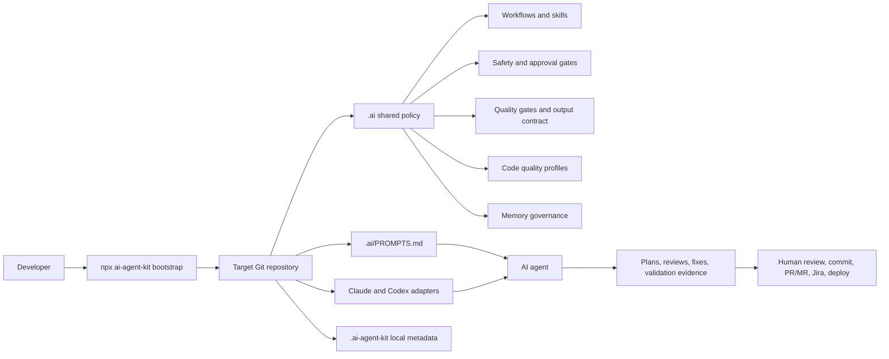
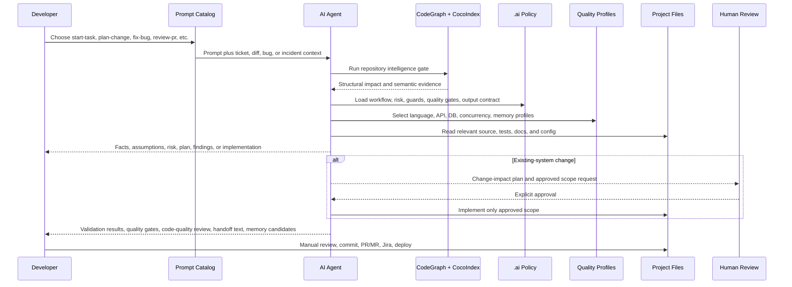

# @hunpeolabs/ai-agent-kit

[](https://www.npmjs.com/package/@hunpeolabs/ai-agent-kit)
[](https://www.npmjs.com/package/@hunpeolabs/ai-agent-kit)
[](https://github.com/phamhungptithcm/ai-agent-kit/actions/workflows/npm-publish.yml)

Bootstrap a repository-scoped AI agent operating system for Claude Code and OpenAI Codex, with an adapter strategy for other AI coding agents.

It installs shared `.ai/` policy, Claude/Codex adapter files, role skills, safety gates, language-aware code-quality profiles, review handoff templates, prompt catalogs, and local repository-intelligence checks powered by CodeGraph and CocoIndex.

```bash
npx --yes @hunpeolabs/ai-agent-kit@latest bootstrap
```

## Why Teams Use It

Most AI coding setups start with a prompt file. This kit gives a team an operating model:

- One shared source of truth in `.ai/` for workflow, risk, security, testing, delivery evidence, and approval gates.
- Claude Code and Codex receive the same team policy through generated platform adapters.
- The adapter model is designed to expand to other agents without forking team policy.
- Every task starts with repository intelligence: CodeGraph for structure and CocoIndex for semantic code/document retrieval.
- Code changes use language/version and platform/domain-aware quality profiles for Go, Java, Python, TypeScript/JavaScript, web apps, mobile apps, desktop apps, infrastructure, DevOps, APIs, databases, concurrency, and memory/resource lifecycle.
- Existing-system changes stop at an impact plan until a human explicitly approves implementation.
- Bootstrap is fast and local by default: no tool install, no full reindex, no branch, commit, push, MR, Jira update, deployment, or application source edit.

## How It Works

AI Agent Kit turns a target repository into a governed AI-agent workspace without changing application source code.



What bootstrap affects in a project:

| Area | Purpose |
| --- | --- |
| `.ai/` | Shared policy, prompt catalog, workflows, skills, guards, scripts, evals, quality gates, and memory governance. |
| `.ai/quality-profiles/` | Language, platform/domain, and cross-cutting review profiles for clean code, app behavior, API behavior, performance, DB safety, infrastructure, DevOps, concurrency, and memory/resource lifecycle. |
| `AGENTS.md`, `CLAUDE.md` | Route Codex and Claude Code to the same team rules. |
| `.codex/`, `.claude/`, `.agents/` | Platform adapters, roles, generated skills, hooks, and command rules. |
| `.mcp.json` | Local repository-intelligence tool wiring. |
| `.ai-agent-kit/` | Local backups, install report, and copy-ready handoff drafts. |
| `.gitignore` | Managed ignores for local AI-agent caches and backups. |

It does not edit application source, stage files, commit, push, open PRs/MRs, update Jira, or deploy.

## Prompt-To-Project Loop

Developers start from a purpose-named prompt, not a blank chat. The agent then follows repository policy before producing output that can safely flow back into the project.



See the full design walkthrough in [High-Level Design](docs/HIGH_LEVEL_DESIGN.md).

## Agent Ecosystem And Roadmap

AI Agent Kit ships concrete adapters for Claude Code and OpenAI Codex today. The broader model is adapter-based: keep `.ai/` as the source of truth, then generate thin adapters for each agent surface.

Common adapter targets teams ask about:

| Agent | Planned Adapter Surface |
| --- | --- |
| GitHub Copilot coding agent | Copilot repository instructions, path-specific instructions, `AGENTS.md`. |
| Cursor | Cursor Rules, `AGENTS.md`, prompt catalog, MCP config. |
| Windsurf / Devin Desktop Cascade | `.windsurf/skills/`, `AGENTS.md`, `.agents/skills/`. |
| Gemini CLI / Gemini Code Assist | `GEMINI.md`, `.mcp.json`, prompt catalog. |
| Amazon Q Developer | `.amazonq/rules/*.md`, prompt catalog, validation commands. |
| JetBrains Junie | `AGENTS.md`, `.junie/AGENTS.md`, guidelines, skills. |
| Cline, Devin, Aider, Continue | Agent-specific instructions, playbooks/rules/config, prompt catalog, quality gates. |

See [Agent Adapter Strategy](docs/AGENT_ADAPTER_STRATEGY.md) for the support model, current status, and expansion order.

## Who It Helps

| Audience | What they get |
| --- | --- |
| Engineering managers | Consistent AI-assisted delivery rules, safer delegation, clearer review evidence. |
| Developers | Ready-to-use Claude/Codex skills for planning, implementation, bug fixes, reviews, incidents, and docs. |
| QA | Risk-aware test strategy, validation evidence, regression thinking, and demo artifact templates. |
| HR and onboarding leads | A repeatable team working model that new engineers can install into a repository in one command. |

## Persona Bundles

Team members can ask for a role instead of remembering every skill name:

| Persona | Composed skills |
| --- | --- |
| Solution Architect | `start-task` + `repository-intelligence` + `design-document` + `architecture-review` |
| Senior Backend Engineer | `implement-feature` + `database-change` + `code-review` + `code-quality-review` |
| Production SRE | `production-incident` + `performance-investigation` + `observability-review` |
| Security Engineer | `security-review` + `threat-model` + `code-review` |
| QA Lead | `test-strategy` + `code-quality-review` + `delivery-documentation` |
| Release Manager | `release-readiness` + `delivery-documentation` + `jira-completion-package` |
| Tech Lead | `change-impact-plan` + `architecture-review` + `repository-health` |

## Quick Start

Run inside the target Git repository. This is the recommended fast path for team rollout:

```bash
npx --yes @hunpeolabs/ai-agent-kit@latest bootstrap
```

After bootstrap, open `.ai/PROMPTS.md` in the target repository or print copy-ready prompts:

```bash
npx --yes @hunpeolabs/ai-agent-kit@latest prompts
npx --yes @hunpeolabs/ai-agent-kit@latest prompt start-task
npx --yes @hunpeolabs/ai-agent-kit@latest prompt plan-change
npx --yes @hunpeolabs/ai-agent-kit@latest prompt code-quality-review
```

Preview the planned files without writing anything:

```bash
npx --yes @hunpeolabs/ai-agent-kit@latest bootstrap --dry-run
```

Run the heavier repository-intelligence setup only when needed:

```bash
npx --yes @hunpeolabs/ai-agent-kit@latest bootstrap --deep
```

`--deep` installs missing CodeGraph/CocoIndex tools and refreshes indexes. For large repositories, prefer the fast bootstrap first, then run deep indexing before risky implementation, impact analysis, or PR review.

Install only one platform adapter:

```bash
npx --yes @hunpeolabs/ai-agent-kit@latest bootstrap --claude-only
npx --yes @hunpeolabs/ai-agent-kit@latest bootstrap --codex-only
```

## What Gets Installed

- `.ai/`: shared policy, workflows, skills source, guards, scripts, prompts, templates, and evals.
- `.claude/` and `CLAUDE.md`: Claude Code adapter files.
- `.codex/`, `.agents/`, and `AGENTS.md`: Codex adapter files and generated skills.
- `AI_AGENT_TEAM_GUIDE.md`: human-readable operating guide for the team.
- `.ai-agent-kit/`: local installation metadata, backups, transaction reports, and copy-ready review/Jira output.

The bundled scaffold lives under `assets/enterprise-ai-agent-os/`.

## Safety Model

The bootstrap command detects the current Git repository, safely merges managed sections, installs or refreshes AI-agent config, checks CodeGraph and CocoIndex status, validates the setup, prints the local diff, and stops. It skips tool installation and index refresh by default to keep adoption fast; use `--install-tools`, `--refresh-indexes`, or `--deep` when the team wants full repository-intelligence setup in the same command.

It does not:

- stage files
- create commits
- create branches
- push to remotes
- create merge requests
- call GitLab, GitHub, Jira, or deployment APIs
- modify application source code

## Local Development

```bash
npm ci
npm run check
npm run release:dry-run
```

Useful individual commands:

```bash
npm run lint
npm run typecheck
npm test
npm run build
```

## Publishing

The GitHub Actions workflow in `.github/workflows/npm-publish.yml` validates pull requests and main-branch pushes, then publishes to npm when a matching `v*.*.*` tag points to a commit on `main`. It can also publish from `main` when manually dispatched with `publish=true`.

For the first publish, add a granular npm access token as the GitHub Actions secret `NPM_TOKEN`. Never store npm tokens in repository variables.

After the package exists on npm, configure npm Trusted Publishing with GitHub owner `phamhungptithcm`, repository `ai-agent-kit`, and workflow `npm-publish.yml`. The workflow already grants the required OIDC permission, so `NPM_TOKEN` can then be removed.

## Learn More

- [High-level design](docs/HIGH_LEVEL_DESIGN.md)
- [Code Quality Intelligence](docs/CODE_QUALITY_INTELLIGENCE.md)
- [Agent adapter strategy](docs/AGENT_ADAPTER_STRATEGY.md)
- [Adoption guide](docs/ADOPTION_GUIDE.md)
- [Public launch checklist](docs/PUBLIC_LAUNCH_CHECKLIST.md)
- [Security policy](SECURITY.md)
- [Changelog](CHANGELOG.md)
