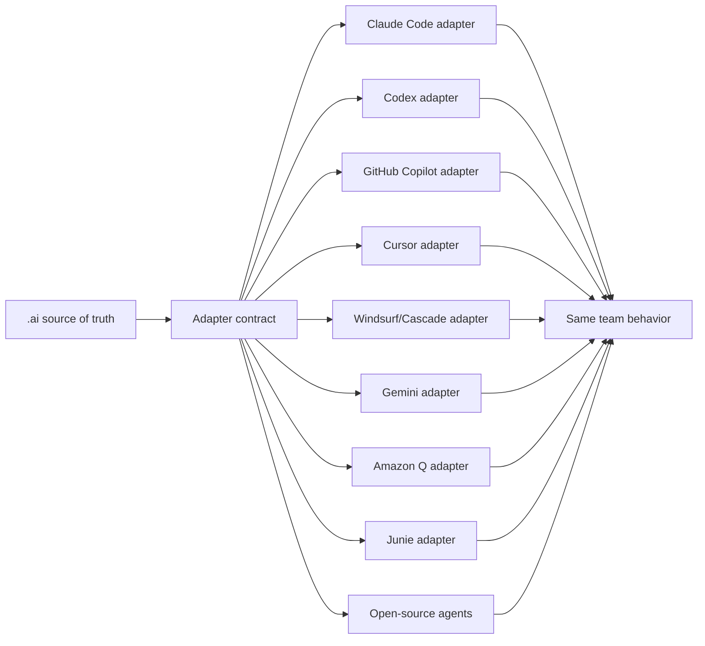

# Agent Adapter Strategy

AI Agent Kit currently ships repository adapters for Claude Code and OpenAI Codex. The long-term design is broader: `.ai/` is the source of truth, and each AI coding tool gets a thin adapter that points back to the same policy, prompts, skills, guards, quality gates, and output contract.

This keeps the team operating model stable even when developers use different AI agents.

## Support Status

| Status | Meaning |
| --- | --- |
| Shipped | The package installs concrete adapter files today. |
| Adapter-ready | The product has a known repository instruction, rule, skill, MCP, or workflow surface that can map to `.ai/`. |
| Research | The product is relevant, but adapter behavior needs deeper validation before generating files. |

## Shipped Today

| Agent | Adapter Surface | Current Package Behavior |
| --- | --- | --- |
| Claude Code | `CLAUDE.md`, `.claude/`, `.claude/skills/` | Installs root instructions, Claude config, commands, agents, and generated skills. |
| OpenAI Codex | `AGENTS.md`, `.codex/`, `.agents/skills/` | Installs root instructions, Codex config, hooks, rules, agents, and generated skills. |

## Adapter-Ready Targets

This is not a strict popularity ranking. It is a practical list of widely discussed or enterprise-relevant AI coding agents with official surfaces that can plausibly consume repository policy.

| Target Agent | Why It Matters | Likely Adapter Surface |
| --- | --- | --- |
| GitHub Copilot coding agent | Common enterprise default because it is tied to GitHub, PRs, and repository workflows. | `.github/copilot-instructions.md`, `.github/instructions/*.instructions.md`, `AGENTS.md`, PR/code-review instructions. |
| Cursor | Popular agentic IDE with team rules, project rules, skills, MCP, and AGENTS.md support. | Cursor Rules, AGENTS.md, prompt catalog, MCP config. |
| Windsurf / Devin Desktop Cascade | Agentic IDE with skills, workflows, AGENTS.md, hooks, and cross-agent skill discovery. | `.windsurf/skills/`, `AGENTS.md`, `.agents/skills/`, workflow docs. |
| Google Gemini CLI / Gemini Code Assist | Terminal agent with project context via `GEMINI.md` and MCP-oriented workflows. | `GEMINI.md`, `.mcp.json`, prompt catalog. |
| Amazon Q Developer | Enterprise/AWS-oriented assistant with IDE and CLI rules. | `.amazonq/rules/*.md`, prompt catalog, validation commands. |
| JetBrains Junie | JetBrains-native coding agent with guidelines, memory, CLI/IDE surfaces, and AGENTS.md import behavior. | `AGENTS.md`, `.junie/AGENTS.md`, guidelines, skills. |
| Cline | Open-source agent runtime with editor/terminal workflow and human-in-the-loop approvals. | AGENTS.md-style project rules, MCP config, prompt catalog, approval guidance. |
| Devin | Cloud software engineer with AGENTS.md, Playbooks, Knowledge, and ticket-oriented workflows. | `AGENTS.md`, playbook templates, memory/governance mapping. |
| Aider | Terminal pair-programming agent for local git repositories. | `CONVENTIONS.md`/repo instructions, prompt catalog, quality-gate commands. |
| Continue | Open-source coding agent across CLI, VS Code, and JetBrains plugin. | Rules/config, prompt catalog, validation commands. |

## Adapter Contract

Every new adapter should be thin. It should not fork policy.

Required adapter behavior:

1. Route the agent to `.ai/` as the durable source of truth.
2. Point daily users to `.ai/PROMPTS.md` and `ai-agent-kit prompt <name>`.
3. Reuse `.ai/skills-src/` when the target agent supports `SKILL.md` style skills.
4. Preserve the same repository intelligence gate expectation.
5. Preserve the existing-system approval gate.
6. Preserve quality gates and output contract.
7. Preserve memory governance: approved-only retrieval, bounded results, no sensitive data.
8. Keep bootstrap local-only: no automatic branch, commit, push, PR/MR, Jira update, deploy, or application source edit.
9. Add validator checks so generated adapter files cannot drift silently.

## Adapter Generation Pattern

## Recommended Roadmap

1. GitHub Copilot adapter: high enterprise value and direct repository instruction support.
2. Cursor adapter: high developer adoption and good rules/skills/MCP alignment.
3. Windsurf/Cascade adapter: strong skill compatibility with `.agents/skills/` and `.windsurf/skills/`.
4. Gemini CLI adapter: simple root `GEMINI.md` plus MCP alignment.
5. Amazon Q Developer adapter: useful for AWS-heavy organizations.
6. JetBrains Junie adapter: useful for IntelliJ/PyCharm/WebStorm-heavy teams.
7. Open-source terminal/editor agents: Cline, Aider, Continue, and similar tools.

## Sources Reviewed

- GitHub Copilot repository custom instructions: https://docs.github.com/en/copilot/how-tos/copilot-on-github/customize-copilot/add-custom-instructions/add-repository-instructions
- Cursor Rules: https://cursor.com/docs/rules
- Cursor coding-agent best practices: https://cursor.com/blog/agent-best-practices
- Windsurf/Cascade skills: https://docs.devin.ai/desktop/cascade/skills
- Gemini CLI `GEMINI.md`: https://google-gemini.github.io/gemini-cli/docs/cli/gemini-md.html
- Amazon Q Developer project rules: https://docs.aws.amazon.com/amazonq/latest/qdeveloper-ug/context-project-rules.html
- JetBrains Junie guidelines and memory: https://junie.jetbrains.com/docs/guidelines-and-memory.html
- Cline overview: https://docs.cline.bot/cline-overview
- Devin AGENTS.md: https://docs.devin.ai/onboard-devin/agents-md
- Aider: https://aider.chat/
- Continue docs: https://docs.continue.dev/
