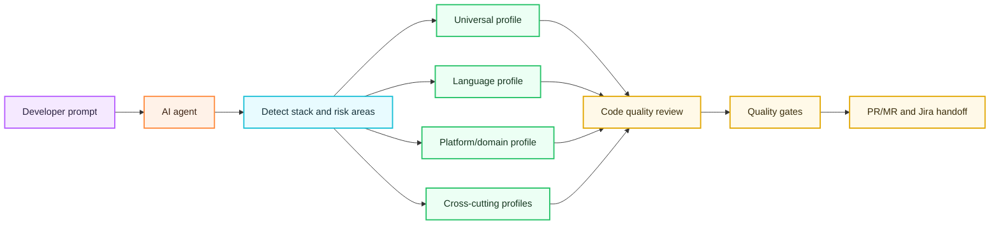

# Code Quality Intelligence

Code Quality Intelligence is the layer that asks an AI coding agent to review code like it understands the stack, not like it is applying a generic checklist.

The agent must detect the project language, version, framework, runtime, application/platform type, delivery surface, package/build tools, test tools, lint/type/security tools, and risk areas before implementation, bug fixing, PR review, or handoff. It then applies the universal profile plus matching language, platform/domain, and cross-cutting profiles from `.ai/quality-profiles/`.

## What It Improves

- Cleaner code that follows the repository's existing patterns.
- Better fit with the language/runtime version already used by the project.
- Stronger API compatibility review for payloads, error shapes, idempotency, pagination, and versioning.
- Better platform-specific review for web apps, mobile apps, desktop apps, infrastructure, and DevOps delivery.
- More deliberate performance review around loops, I/O, queries, blocking calls, allocations, and bundle size.
- Database safety checks for connection/session/cursor lifecycle, transaction boundaries, locking, migrations, and rollback.
- Concurrency checks for races, deadlocks, task/thread/goroutine leaks, cancellation, timeouts, and pool sizing.
- Memory/resource checks for heap retention, unbounded caches, listeners, timers, streams, files, sockets, and cleanup ownership.

## Profile Layers

## Supported Profiles

| Profile | Purpose |
| --- | --- |
| `universal.yaml` | Clean code, error handling, resource cleanup, validation, API compatibility, performance, DB lifecycle, concurrency, memory, observability. |
| `go.yaml` | Go version/toolchain, `gofmt`, `go test`, race risk, goroutine leaks, channels, context cancellation, `database/sql`, heap retention. |
| `java.yaml` | Java toolchains, Maven/Gradle tests, static analysis, Spring/JPA/JDBC lifecycle, transactions, `repository.save()` loop risks, executors, heap leaks. |
| `python.yaml` | Python versions, `pytest`, `ruff`, typing, async task leaks, SQLAlchemy/Django lifecycle, context managers, memory retention. |
| `typescript-javascript.yaml` | Node/browser versions, TypeScript checks, promises, abort/cancellation, event-loop blocking, client release, bundle size, XSS. |
| `frontend-html-css.yaml` | HTML/CSS accessibility, responsive layout, text overflow, semantic HTML, rendering performance, asset/font loading. |
| `web-app.yaml` | Web routes, rendering, hydration, browser security, sessions, accessibility, Core Web Vitals, browser smoke evidence. |
| `mobile-app.yaml` | Mobile lifecycle, permissions, offline sync, secure storage, battery, memory leaks, OS compatibility, signing/release safety. |
| `desktop-app.yaml` | Desktop UI thread, OS integration, file/process/IPC safety, installer, auto-update, code signing, native resource cleanup. |
| `infrastructure.yaml` | IaC plans, IAM least privilege, secrets, networking, drift, cost, reliability, observability, production rollback. |
| `devops.yaml` | CI/CD, release gates, pipeline permissions, secrets, artifact provenance, supply chain, deployment/rollback handoff. |
| `api.yaml` | Contract compatibility, validation, auth, idempotency, retries, pagination, versioning, audit fields. |
| `database.yaml` | Migrations, query plans, connection/session/cursor lifecycle, transaction safety, locking, batch/bulk persistence, rollback. |
| `concurrency.yaml` | Races, deadlocks, lifecycle leaks, cancellation, backpressure, worker pools, async blocking. |
| `memory.yaml` | Resource cleanup, heap retention, cache growth, listener/timer cleanup, stream/file/socket close behavior, profiling plan. |

## Expansion Model

The kit does not try to encode every programming language on day one. It gives a small, enforceable profile contract:

1. Detect the stack from real repository files.
2. Apply `universal.yaml`.
3. Apply any matching language profiles.
4. Apply any matching platform/domain profiles.
5. Apply API/database/concurrency/memory profiles when those risks appear.
6. If a language or domain is missing, document the gap as a new team-approved profile candidate.

That makes it practical to add more languages over time without weakening the base standard.
