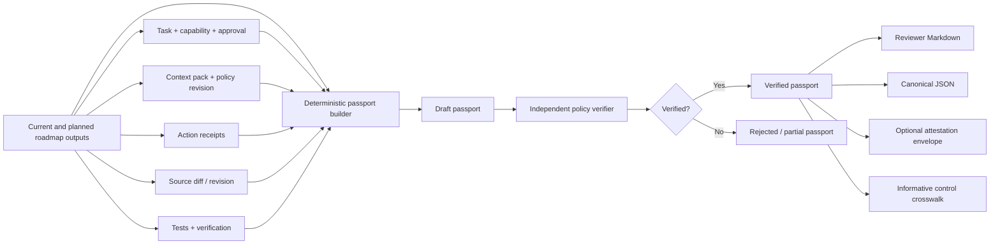

# Additive Discovery Plan: AI Change Assurance Passport

Status: **DRAFT FOR OWNER REVIEW**

Decision state: **NOT APPROVED**

Implementation authorization: **NONE**

Document date: 2026-07-29

Proposed discovery window: 2026-07-30 through 2026-09-11

Earliest implementation window: after the current v1.0.0 roadmap window, unless
a separately staffed workstream receives explicit approval.

## 1. Purpose

This document proposes an additive product discovery track for AI Agent Kit. It
does not replace, reprioritize, delay, or add requirements to the existing
v0.5.0-v1.0.0 roadmap.

The proposed product concept is an **AI Change Assurance Passport**: a portable,
machine-verifiable and reviewer-readable artifact that answers:

1. What change was requested?
2. What scope and authority were approved?
3. Which repository revision, policy revision and context were used?
4. Which actions were attempted, allowed, rejected or executed?
5. What changed and how was it verified?
6. Which claims are proven, declared, unavailable or still uncertain?

The passport would consume stable outputs from the existing roadmap. It is not
an agent runtime, a replacement for provider hooks, a new context engine, a
compliance certification, or an observability platform.

## 2. Immutable Boundary

The following boundaries are part of this proposal:

- Do not modify the public roadmap in GitHub issue
  [#20](https://github.com/phamhungptithcm/ai-agent-kit/issues/20).
- Do not modify issues #5-#19, their milestones, priorities, acceptance
  criteria or target dates.
- Do not add passport work as a release gate or dependency for v0.6.0-v1.0.0.
- Do not change existing source, assets, tests, release workflows or public
  product claims as part of this discovery.
- Do not create GitHub issues, milestones, branches, commits, releases, pilots
  or external commitments without separate approval.
- Discovery outputs are documents, interview notes, manually constructed
  examples, schemas and decision records only.
- Any future implementation requires a new tracked approval artifact with
  exact paths, constraints, acceptance criteria and release boundaries.

If a discovery activity begins to require changes to the current roadmap, the
activity stops and returns to owner review.

## 3. Executive Recommendation

Run a six-week, documentation-only discovery for the AI Change Assurance
Passport while leaving the current roadmap untouched.

The concept is recommended because it:

- turns the kit's existing and planned governance primitives into a
  buyer- and reviewer-consumable outcome;
- remains provider-neutral while vendors continue to build their own hooks,
  approvals, guardrails and tracing;
- can use existing task, capability, context, receipt, evidence, diff and test
  artifacts instead of creating another agent runtime;
- has a credible path to interoperable attestations without claiming formal
  compliance;
- can be validated manually before any implementation;
- can be postponed or killed without affecting any current milestone.

The discovery recommendation is not a recommendation to implement or release
the product.

## 4. Current Baseline

The baseline was verified on 2026-07-29:

- Local `main` is clean at commit `747289ca0410b57b3160847055afdf0ed2ced303`.
- GitHub release
  [v0.5.0](https://github.com/phamhungptithcm/ai-agent-kit/releases/tag/v0.5.0)
  is published.
- npm `latest` resolves to `@hunpeolabs/ai-agent-kit@0.5.0`.
- The local test suite passes 47 of 47 tests.
- The current source contains migration-safe local update, task-aware context
  packs, 12 adapter surfaces, governed task state, scoped capabilities,
  deterministic policy decisions, hash-linked receipts, evidence verification,
  approved memory and evidence export.

Relevant existing implementation surfaces include:

- `src/context-compiler.mjs`: deterministic JSON/Markdown context packs,
  repository and policy identity, provenance, exclusions, token budget and
  content hash.
- `src/governed-runtime.mjs`: task/capability identity, approval hash,
  repository commit, policy revision, agent adapter, state transitions,
  `allow/ask/deny` decisions, hash-linked receipts and evidence export.
- `src/update.mjs`: update plan, base/local/incoming decisions, conflict
  evidence, backup, journal and rollback.
- `src/adapters.mjs`: provider-specific repository surfaces backed by one
  shared contract.

The shipped evidence is locally hash-linked, but it is not yet a portable
attestation. It does not currently provide all of the following as one
verifiable artifact:

- a stable subject identity for the resulting source revision or pull request;
- a direct binding between task, context pack, approval, action receipts,
  actual diff and verification outputs;
- an explicit verifier identity and verification policy;
- a signed or DSSE/in-toto-compatible envelope;
- selective disclosure profiles;
- a portable status model that another organization or tool can verify;
- an informative governance-control crosswalk with claim limitations.

These gaps are an additive opportunity, not defects that this document asks the
current roadmap to fix.

### Red-team assumptions

The architecture review identified constraints that prevent the discovery from
making stronger claims:

- The current context-pack content hash includes checkout-specific repository
  identity, so cross-checkout and cross-OS reproducibility must be proven rather
  than assumed.
- A self-consistent hash chain has no external trust anchor. Rewriting an entire
  local ledger is different from modifying one receipt inside the existing
  chain.
- The current runtime evaluator records policy decisions but is not yet a
  universal execution boundary. A passport cannot claim that all actions were
  enforced until it consumes evidence from an actual supported execution path.
- Evidence creation and task-state updates must not be assumed to be an atomic,
  concurrency-safe transaction.
- A recorded test claim is not proof that the test ran or passed unless the
  named verifier independently evaluates the referenced result.

These are input-quality constraints for a future passport. This discovery does
not assign fixes, priorities or dates to the current roadmap.

## 5. Market Evidence

All sources below are primary or official sources reviewed on 2026-07-29.

| Evidence | What it means for this discovery |
| --- | --- |
| [OpenAI Agents SDK guardrails](https://openai.github.io/openai-agents-js/guides/guardrails/) and [human-in-the-loop](https://openai.github.io/openai-agents-js/guides/human-in-the-loop/) provide tool checks, approvals and resumable state. | Basic guardrails and approval are becoming provider capabilities. The kit should not compete by building another general agent runtime. |
| [OpenAI tracing](https://openai.github.io/openai-agents-js/guides/tracing/) records generations, tool calls, handoffs and guardrails. | A passport should summarize and verify engineering intent and outcomes, not recreate a trace backend. |
| [GitHub Copilot hooks](https://docs.github.com/en/copilot/concepts/agents/hooks) can approve or deny tools and record agent activity. | Provider-native enforcement is useful but fragmented. A provider-neutral assurance artifact remains plausible. |
| [GitHub custom agents](https://docs.github.com/en/copilot/concepts/agents/cloud-agent/about-custom-agents) exist at repository, organization and enterprise levels. | Portable policy semantics and evidence matter more than merely generating another agent profile. |
| [MCP security guidance](https://modelcontextprotocol.io/docs/tutorials/security/security_best_practices) documents SSRF, token, local-server, consent and least-privilege risks. | Tool identity, granted capability and security decisions must be visible in the artifact; a server name alone is insufficient evidence. |
| The [Agent Skills specification](https://agentskills.io/specification) standardizes a portable skill directory while `allowed-tools` remains experimental. | Portable instructions are converging, but enforcement and verified outcomes still vary by client. |
| [A2A is hosted by the Linux Foundation](https://developers.googleblog.com/google-cloud-donates-a2a-to-linux-foundation/). | Inter-agent portability is moving toward open protocols; assurance should be protocol- and provider-neutral. |
| [NIST AI RMF](https://www.nist.gov/itl/ai-risk-management-framework) uses govern, map, measure and manage outcomes. | A passport may support evidence collection and review, but must not claim that an artifact proves organizational compliance. |
| [NIST SSDF](https://csrc.nist.gov/projects/ssdf) includes provenance and security decision tracking. | The artifact can provide an informative secure-development evidence mapping. |
| [SLSA provenance](https://slsa.dev/spec/v1.2/provenance) and [Verification Summary Attestations](https://slsa.dev/spec/v1.2/verification_summary) separate provenance from verification. | Reusing attestation concepts is more credible than inventing an incompatible trust format. The passport must still avoid claiming a SLSA level it has not verified. |

### Market interpretation

Provider runtimes increasingly offer their own instructions, hooks, approvals,
guardrails, subagents and traces. Therefore:

- "shared prompts" is not a durable standalone differentiation;
- "we have approval gates" is not unique;
- "we have repository intelligence" is not a defensible claim by itself;
- recreating LangGraph, LangSmith, CrewAI or a hosted trace dashboard would
  broaden the product away from its repository-native strength.

The more credible wedge is:

> A repository-native, provider-neutral control and assurance layer that proves
> whether an AI-assisted source change matched approved intent and verification
> expectations.

This remains a hypothesis. No customer demand, willingness to pay, compliance
acceptance or product-market fit has been established.

## 6. Candidate Ideas Considered

Scores are internal discovery hypotheses on a 1-5 scale. They are not customer
research results.

Weights:

- Roadmap isolation: 25%
- Fit with current/planned primitives: 20%
- Differentiation from provider features: 20%
- Verifiability: 15%
- User/reviewer value: 10%
- Execution risk: 10%, where a higher score means lower risk

| Candidate | Isolation | Fit | Differentiation | Verifiability | Value | Risk | Weighted result |
| --- | ---: | ---: | ---: | ---: | ---: | ---: | ---: |
| AI Change Assurance Passport | 5 | 5 | 4 | 5 | 5 | 4 | 4.70 |
| Read-only Local Governance Console | 5 | 4 | 3 | 4 | 4 | 4 | 4.05 |
| Policy Contract Test Kit | 4 | 5 | 3 | 5 | 4 | 4 | 4.20 |
| Upgrade Rehearsal Lab | 5 | 4 | 4 | 5 | 3 | 4 | 4.30 |
| Continuous Vendor Drift Monitor | 5 | 4 | 4 | 4 | 3 | 3 | 4.05 |
| Governed Workflow Reference Packs | 5 | 4 | 2 | 3 | 4 | 5 | 3.85 |
| Adoption Pilot Protocol | 5 | 3 | 4 | 3 | 4 | 5 | 4.00 |

### Why the passport ranks first

It provides one product outcome above the existing primitives. The console is
mainly presentation, the test kit overlaps planned conformance work, the
rehearsal lab focuses only on upgrades, and the drift monitor is an operational
maintenance capability. All may remain later modules, but none should be added
to the current roadmap through this document.

## 7. Product Concept

### Working name

**AI Change Assurance Passport**

The name is provisional. It must not imply government identity, legal approval
or third-party certification.

### One-sentence definition

A portable evidence artifact that binds an AI-assisted source change to its
task intent, approved authority, repository and policy state, action history,
resulting diff and independent verification.

### Primary users

1. **Pull-request reviewer**
   - Needs to understand scope, material actions, tests, residual risk and
     uncertainty without reading a full agent transcript.
2. **Tech lead or repository owner**
   - Needs proof that the implemented diff stayed inside an approved plan and
     repository revision.
3. **AppSec or platform engineering**
   - Needs deterministic policy decisions, tool identity, permission use,
     provenance and exceptions.
4. **Engineering manager**
   - Needs aggregate assurance outcomes without prompts, chain-of-thought,
     source content or secrets.
5. **Auditor or downstream consumer**
   - Needs a verifiable, selectively disclosed summary and clear limitations,
     not a vendor-specific trace.

### Jobs to be done

- "Before I merge this change, show me whether it matches what was approved."
- "Show me which evidence is independently verified versus merely declared."
- "Let me verify the artifact without access to raw agent conversations."
- "Let the same assurance contract work across supported coding agents."
- "Give me a compact evidence package that can travel with a source revision."

### Non-goals

- Execute an agent or replace an agent SDK.
- Store or replay chain-of-thought.
- Copy full prompts, source files, secrets or raw command output.
- Replace Git, CI, code review, security review or human approval.
- Guarantee that generated code is correct or secure.
- Certify NIST AI RMF, SSDF, SLSA, ISO, SOC 2, EU AI Act or other compliance.
- Become a hosted observability platform in the first version.
- Require a HunpeoLabs account or cloud control plane.
- Change existing roadmap scope or release dates.

## 8. Assurance Model

Every material claim must have one of four evidence states:

| State | Meaning |
| --- | --- |
| `VERIFIED` | A named verifier evaluated evidence against an identified policy and produced a reproducible result. |
| `OBSERVED` | A source artifact records the event, but no independent policy verification was completed. |
| `DECLARED` | A human, agent or external system supplied the claim; the passport does not prove it. |
| `UNAVAILABLE` | Required or useful evidence was missing, inaccessible, stale or intentionally withheld. |

The overall passport must never be more authoritative than its weakest critical
claim. A hash proves integrity after creation; it does not prove that the
original statement was true.

### Proposed status model

- `DRAFT`: artifact is incomplete and must not be used for merge assurance.
- `COMPLETE`: all required sections exist, but verification is not complete.
- `VERIFIED`: required claims pass the declared verification policy.
- `REJECTED`: at least one blocking verification failed.
- `EXPIRED`: repository, policy, approval or evidence freshness no longer
  satisfies the verification policy.
- `PARTIAL`: a non-critical subset is verified, with explicit missing evidence.

`PARTIAL` must never be displayed as equivalent to `VERIFIED`.

## 9. Conceptual Artifact Contract

This is a design sketch, not an approved public schema.

```json
{
  "schemaVersion": "0.1-draft",
  "passportId": "sha256:...",
  "subject": {
    "repository": "repository identity or privacy-preserving digest",
    "baseRevision": "git commit",
    "resultRevision": "git commit or null",
    "pullRequest": "optional reference",
    "diffDigest": "sha256:..."
  },
  "intent": {
    "taskId": "TASK-123",
    "goalDigest": "sha256:...",
    "acceptanceCriteriaDigest": "sha256:...",
    "planRevision": 2
  },
  "authority": {
    "approvalDigest": "sha256:...",
    "capabilityDigest": "sha256:...",
    "allowedTools": ["read", "edit", "test"],
    "allowedPaths": ["src/**", "test/**"],
    "riskCeiling": "medium",
    "expiresAt": "RFC3339 timestamp"
  },
  "context": {
    "contextPackDigest": "sha256:...",
    "repositoryRevision": "git commit",
    "policyRevision": "identifier",
    "intelligenceMode": "READY",
    "exclusionsDigest": "sha256:..."
  },
  "execution": {
    "agentAdapter": "codex",
    "actionReceiptRoot": "sha256:...",
    "allowed": 0,
    "asked": 0,
    "denied": 0,
    "exceptions": []
  },
  "verification": {
    "policy": "repository verification policy identifier",
    "verifier": "verifier identity",
    "checks": [],
    "status": "VERIFIED",
    "verifiedAt": "RFC3339 timestamp"
  },
  "claims": [],
  "disclosureProfile": "reviewer",
  "envelope": {
    "format": "unsigned-draft",
    "digest": "sha256:..."
  }
}
```

### Required sections

1. **Subject**
   - Exact source artifact or diff being evaluated.
2. **Intent**
   - Goal, acceptance criteria and plan revision.
3. **Authority**
   - Approval, capability boundaries, expiry and risk ceiling.
4. **Context**
   - Repository revision, policy revision, context pack and evidence freshness.
5. **Execution**
   - Provider/adapter identity and privacy-minimized action receipt summary.
6. **Verification**
   - Tests, scope match, policy checks, evidence integrity and verifier identity.
7. **Claims and limitations**
   - Claim state, source, verifier and uncertainty.
8. **Envelope**
   - Artifact digest and, only after a separate security design, signature or
     attestation metadata.

### Disclosure profiles

- `developer`: detailed paths, checks and local debugging references.
- `reviewer`: intent, scope, diff, tests, risk and blocking uncertainty.
- `security`: tool identity, permissions, denials, exceptions and policy.
- `external`: minimum metadata, digests, verifier and limitations.

No profile may include secrets, chain-of-thought or raw proprietary source by
default.

## 10. Conceptual Architecture



### Trust boundaries

- The builder may collect artifacts but cannot declare itself independently
  verified merely because it generated them.
- The verifier must identify the policy and inputs it evaluated.
- Repository and policy revision changes invalidate prior freshness claims.
- The agent cannot grant itself additional authority.
- A provider trace is an input, not the root of trust.
- External identity, signing and key management remain a separate security
  decision and are not assumed by this discovery.

### Isolation if implementation is later approved

- Experimental namespace:
  `.ai-agent-kit/experimental/assurance/`.
- Schema starts as `v1alpha1` with no stable compatibility claim.
- Feature is default-off and must not be called by `postinstall`, bootstrap,
  update or governed action execution.
- Builder and verifier read existing artifacts but cannot change task state,
  grant capability, approve an action or rewrite evidence.
- Initial implementation has no network, credential, database or hosted-service
  requirement.
- Removing the experimental namespace must not change installation or runtime
  behavior.
- Experimental verification cannot become a blocking current-roadmap CI gate.

## 11. Relationship To The Existing Roadmap

The passport is downstream of the roadmap. Nothing below adds a requirement to
an existing milestone.

| Existing target | Potential passport input after that target is stable | No-change guarantee |
| --- | --- | --- |
| v0.5.0 | Context pack identity, repository revision and migration evidence. | Passport discovery does not reopen or redefine v0.5.0. |
| v0.6.0 | Normalized action envelopes, policy decisions and MCP trust results. | No new gateway or broker acceptance criteria. |
| v0.7.0 | Replayable eval artifacts, evidence-native PR data and review metrics. | The passport does not replace or block the PR package. |
| v0.8.0 | Effective policy identity, outcome data and governed memory provenance. | No change to overlay, analytics or memory scope. |
| v0.9.0 | Adapter identity, conformance results and standards metadata. | No change to supported adapter promises. |
| v1.0.0 | Stable schemas, compatibility, recovery and security contract. | Current v1 remains the boundary; passport implementation starts later by default. |

If a required input is not shipped, the passport records it as `UNAVAILABLE`;
it does not pull that work into an earlier milestone.

## 12. Threat Model For Discovery

The discovery must design against:

- **Approval substitution:** attaching an approval from another task or diff.
- **Stale-base replay:** using valid evidence from an earlier repository state.
- **Policy substitution:** verifying against a weaker or different policy.
- **Receipt truncation:** omitting denied or failed actions from the summary.
- **Verifier self-assertion:** the producer claims independent verification.
- **Adapter spoofing:** a client claims another adapter or tool identity.
- **Context laundering:** cited context exists but was not actually used.
- **Selective evidence omission:** failed tests or scope drift are excluded.
- **Digest without authenticity:** integrity hashes are presented as signatures.
- **Secret leakage:** paths, parameters, logs or environment values expose data.
- **Compliance overclaim:** an informative mapping is presented as certification.
- **UI trust inflation:** a green badge hides `PARTIAL` or `UNAVAILABLE` claims.

## 13. Six-Week Discovery Timeline

This timeline produces documents and manually generated examples only.

### Week 1 — Boundary and problem discovery

Dates: 2026-07-30 through 2026-08-05

Outputs:

- approved or revised discovery charter;
- interview guide for platform engineering, AppSec, repository owners and
  reviewers;
- problem hypothesis map;
- inventory of current and planned evidence inputs;
- explicit overlap check against issues #5-#20.

Target research:

- 8-12 interviews with teams using at least two coding-agent surfaces;
- at least three repository types: application, infrastructure and regulated or
  high-assurance software.

Gate:

- Continue only if at least five interviewees independently describe a material
  cross-agent evidence, policy-drift or review-assurance problem.

### Week 2 — Assurance and threat contract

Dates: 2026-08-06 through 2026-08-12

Outputs:

- claims taxonomy;
- evidence-state and overall-status rules;
- threat model;
- privacy and redaction requirements;
- trust-boundary diagram;
- non-goals and forbidden claims.

Gate:

- Security review agrees the design does not treat hashes as authenticity and
  does not expose prompts, chain-of-thought, source or secrets by default.

### Week 3 — Schema and reviewer experience

Dates: 2026-08-13 through 2026-08-19

Outputs:

- canonical JSON schema draft;
- reviewer-focused Markdown draft;
- developer, security and external disclosure profiles;
- three manually authored example passports:
  - verified low-risk change;
  - rejected scope-drift change;
  - partial change with stale or unavailable evidence.

Gate:

- Reviewers can identify approval, scope, changed subject, checks, failures and
  residual uncertainty without opening raw agent logs.

### Week 4 — Interoperability and control mapping

Dates: 2026-08-20 through 2026-08-26

Outputs:

- mapping to existing AI Agent Kit artifacts;
- comparison with in-toto/SLSA attestation concepts;
- informative NIST AI RMF and SSDF evidence crosswalk;
- export boundary for GitHub Checks, SARIF and OpenTelemetry;
- versioning and deprecation proposal.

Gate:

- The format does not claim a SLSA level or compliance certification and can be
  verified without a hosted HunpeoLabs service.

### Week 5 — Concierge validation

Dates: 2026-08-27 through 2026-09-02

Outputs:

- manually generated passports for approximately 20 sanitized or public
  AI-assisted change cases;
- reviewer comprehension rubric;
- time-to-answer comparison against normal PR evidence;
- list of evidence that is consistently unavailable;
- commercial and adoption interview notes.

Target signal:

- reviewers can answer "what was approved, what changed, what was verified and
  what remains uncertain" with fewer clarification steps;
- at least two credible design partners request a controlled pilot.

These are target signals, not current results.

### Week 6 — Decision package

Dates: 2026-09-03 through 2026-09-11

Outputs:

- evidence-backed go/no-go memo;
- final candidate schema and example set;
- implementation estimate and isolated staffing proposal;
- unresolved security and legal questions;
- kill, defer or approve recommendation;
- exact delta-approval request if implementation is recommended.

Decision:

- `KILL`, `DEFER`, `CONTINUE_DISCOVERY` or `REQUEST_IMPLEMENTATION_APPROVAL`.

No implementation begins automatically after the decision.

## 14. Conditional Implementation Plan

This section is planning only. It becomes actionable only after explicit
approval. By default, implementation begins no earlier than 2026-10-28, after
the current roadmap window.

### Phase P0 — Contract freeze and approval

Duration: 1 week

- finalize supported inputs and evidence states;
- define versioning, compatibility and privacy contract;
- create tracked approval with exact paths and constraints;
- pass repository intelligence and security preflight;
- establish separate capacity and ownership.

Exit criteria:

- schema `0.1` approved;
- no dependency added to the current roadmap;
- security and privacy reviewers approve the boundary.

### Phase P1 — Deterministic local builder

Duration: 2 weeks

- consume existing task, context and evidence export artifacts;
- bind subject, intent, authority and verification;
- emit canonical JSON and reviewer Markdown;
- reject path traversal, symlinks, oversized inputs and malformed evidence;
- maintain deterministic output except declared timestamps/nonces.

Exit criteria:

- identical normalized inputs produce the same passport digest;
- the same logical run produces the same normalized digest across checkout
  paths and supported operating systems;
- missing critical evidence cannot produce `VERIFIED`;
- no prompts, raw source, raw output or secrets appear in fixtures.

### Phase P2 — Independent verifier

Duration: 2 weeks

- verify digests, receipt chain, repository/policy identity and freshness;
- verify approval-to-subject and scope-to-diff binding;
- evaluate checks against a named verification policy;
- emit stable reason codes and machine-readable failures.

Exit criteria:

- tamper, truncation, stale-base and approval-substitution fixtures fail closed;
- builder output alone cannot self-promote to independently verified.

### Phase P3 — CI and review exports

Duration: 2 weeks

- local CLI export;
- GitHub Check/summary integration without remote writes by the core command;
- references to large logs instead of embedding them;
- optional SARIF and OpenTelemetry mappings.

Exit criteria:

- the core remains local-first and credential-free;
- external publishing is an explicit integration action;
- partial and rejected results are visually distinct.

### Phase P4 — Attestation and crosswalk profiles

Duration: 2 weeks

- evaluate DSSE/in-toto-compatible envelope;
- define verifier identity and key-management options;
- add informative NIST AI RMF/SSDF mappings;
- implement selective-disclosure profiles.

Exit criteria:

- no unsupported certification or SLSA-level claim;
- unsigned, signed and externally verified states cannot be confused;
- privacy regression suite passes.

### Phase P5 — Controlled pilots and hardening

Duration: 4 weeks

- pilot with 2-3 approved design partners;
- test at least three repository/risk profiles;
- measure reviewer comprehension, clarification effort, false confidence,
  generation failures and verification failures;
- complete threat-model and recovery review.

Exit criteria:

- zero critical false-`VERIFIED` cases;
- pilot reviewers find the artifact useful without relying on raw transcripts;
- operational cost and support boundaries are understood;
- owner approves, defers or stops a public release.

Estimated implementation duration after approval: 13 weeks.

The estimate excludes procurement, external audits, legal review, hosted
services and third-party certification.

## 15. Planned Work Packages

These are specification units, not GitHub issues.

| ID | Work package | Acceptance intent |
| --- | --- | --- |
| ACP-01 | Claims taxonomy | Every material claim has a state, source and limitation. |
| ACP-02 | Subject binding | Passport identifies exact base/result/diff subject. |
| ACP-03 | Intent and authority binding | Task, plan, approval and capability are cryptographically linked. |
| ACP-04 | Context binding | Repository, policy and context-pack revisions are explicit. |
| ACP-05 | Action summary | Allowed, asked, denied, failed and exception events cannot be silently omitted. |
| ACP-06 | Verification policy | Verifier, policy, checks, result and reason codes are reproducible. |
| ACP-07 | Privacy profiles | Default exports exclude sensitive content and support bounded disclosure. |
| ACP-08 | Reviewer rendering | Human output makes uncertainty and failure prominent. |
| ACP-09 | Interoperability | Format can map to established attestation concepts without false claims. |
| ACP-10 | Adversarial fixtures | Tamper, replay, substitution, truncation and redaction failures are covered. |
| ACP-11 | Versioning | Schema compatibility and deprecation rules are explicit. |
| ACP-12 | Pilot protocol | Adoption and usefulness are measured without invented success claims. |

## 16. Metrics

No baseline is currently available. Discovery must establish it before setting
release targets.

### Primary

- Reviewer task-to-scope comprehension rate.
- Critical false-`VERIFIED` rate.
- Time required to answer the four assurance questions.
- Percentage of material claims with verifiable provenance.
- Passport verification reproducibility rate.

### Guardrail

- Secret or proprietary-content leakage rate.
- False confidence rate caused by rendering or status aggregation.
- Passport generation failure rate.
- Stale evidence detection rate.
- Cross-agent semantic mismatch rate.
- Additional reviewer burden.

### Commercial discovery

- Number of qualified teams that identify the problem without prompting.
- Number of design partners willing to provide sanitized cases.
- Number willing to complete security review or discuss budget.

Downloads, stars, generated-code volume and raw agent action count are not
proof of product value.

## 17. Go, Defer And Kill Criteria

### Request implementation approval only if

- repeated user research confirms a cross-agent assurance problem;
- manually constructed passports improve reviewer understanding;
- the artifact can be generated without raw transcripts or proprietary source;
- the design adds value beyond the existing v0.7 PR package;
- verification can fail closed for critical missing or stale evidence;
- at least two credible design partners want a controlled pilot;
- separate capacity prevents impact to the current roadmap.

### Defer if

- users value the artifact but required input schemas remain unstable;
- the product is useful only after v1 contract stabilization;
- design partners require integrations not yet available;
- verifier identity or privacy design needs more research.

### Kill if

- reviewers see no material value beyond normal PR checks;
- the concept duplicates the existing evidence-native PR package;
- provider-native controls solve the same cross-agent problem adequately;
- useful output requires storing prompts, source or sensitive traces;
- the design cannot prevent false `VERIFIED` results;
- customers require unsupported compliance certification;
- it would consume capacity or alter gates on the current roadmap.

## 18. Risks And Mitigations

| Risk | Impact | Planned mitigation |
| --- | --- | --- |
| Duplicates v0.7 evidence-native PR work | Product and roadmap confusion | Treat PR package as an input; passport must add portable subject/authority/verifier binding. Kill if this distinction is not valuable. |
| Green-badge false confidence | Unsafe merge or audit misuse | Four claim states, prominent limitations, critical weakest-link aggregation and adversarial UX review. |
| Hashes mistaken for authenticity | Forged evidence appears trusted | Separate integrity, identity and independent verification; do not call unsigned artifacts attested. |
| Sensitive-data leakage | Security and privacy harm | Digest-first schema, bounded disclosure, redaction tests and no raw prompts/source/output by default. |
| Compliance overclaim | Legal and reputational risk | Informative crosswalk only; explicit non-certification language; legal review before public claims. |
| Provider schema drift | Broken or misleading inputs | Versioned adapters, declared source version and optional post-v1 drift monitor. |
| Hosted-platform scope creep | Delays and operational burden | Local builder/verifier first; no hosted dependency in initial scope. |
| Unstable roadmap inputs | Rework | Discovery uses manual examples; implementation defaults to post-v1. |
| No buyer demand | Wasted engineering | Interviews and concierge validation precede implementation. |
| Passport becomes a data dump | Low reviewer value | Role-specific disclosure profiles, summary budget and references to detailed logs. |

## 19. Decisions Requested From The Owner

The owner can review each decision independently:

1. **Discovery approval**
   - Approve only the six-week documentation and validation track.
2. **Concept direction**
   - Confirm whether AI Change Assurance Passport is the preferred candidate or
     request comparison with another candidate.
3. **Roadmap isolation**
   - Confirm the current v0.5.0-v1.0.0 roadmap remains unchanged and has first
     claim on implementation capacity.
4. **External research**
   - Approve or reject outreach to prospective interviewees/design partners.
   - No outreach is performed under the current request.
5. **Implementation timing**
   - Default: no implementation before 2026-10-28.
   - Any earlier work requires separately staffed capacity and delta approval.

Silence or review comments do not constitute implementation approval.

## 20. Approval Checklist For Any Future Implementation

Before implementation:

- [ ] Owner approved the concept and exact phase.
- [ ] A tracked approval artifact exists.
- [ ] Approved paths and exclusions are explicit.
- [ ] Repository Intelligence Gate is current and acceptable.
- [ ] Security and privacy threat model is reviewed.
- [ ] Public claims and non-claims are approved.
- [ ] The work has separate capacity or a post-v1 start date.
- [ ] Existing GitHub roadmap issues and milestones remain unchanged.
- [ ] Tests, rollback and release gates are defined.
- [ ] External writes and integrations have separate authorization.

## 21. Research Limitations

- No customer interviews were performed for this document.
- No design partner has committed to a pilot.
- No willingness-to-pay evidence exists.
- No compliance framework owner or external auditor has reviewed the concept.
- No passport schema has been implemented or independently security-reviewed.
- Competitive product behavior may change after the access date.
- Repository tests demonstrate the current package baseline, not passport
  feasibility.
- The weighted candidate scoring is a decision aid, not empirical market data.

## 22. Review Outcome

Record one outcome when review is complete:

- [ ] `REJECTED`
- [ ] `REVISE`
- [ ] `DISCOVERY_APPROVED`
- [ ] `DEFERRED_UNTIL_POST_V1`

Implementation remains unauthorized unless a later approval explicitly says
otherwise.
