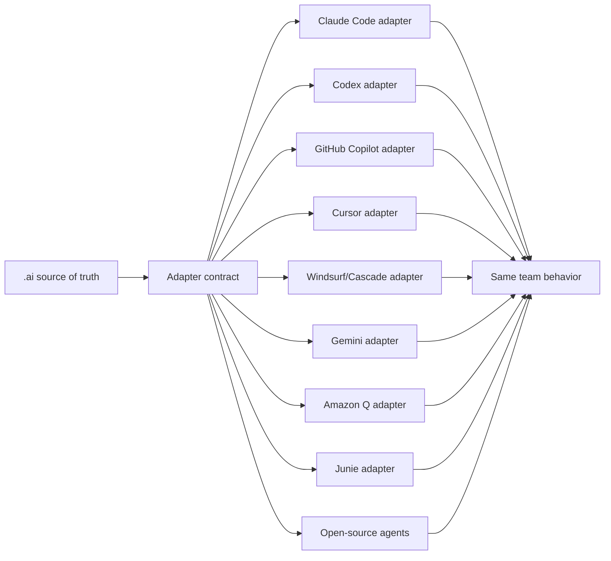

# Agent Adapter Strategy

`.ai/` is the source of truth. Every supported coding tool gets a thin adapter
that points to the same policy, prompts, skills, guards, quality gates, and
output contract. The adapter registry makes support levels and limitations
machine-readable instead of relying on marketing claims.

This keeps the team operating model stable even when developers use different AI agents.

## Supported adapters

| Target Agent | Implemented Adapter Surface |
| --- | --- |
| Claude Code | `CLAUDE.md`, `.claude/`, `.claude/skills/` |
| OpenAI Codex | `AGENTS.md`, `.codex/`, `.agents/skills/` |
| GitHub Copilot | `.github/copilot-instructions.md`, `.github/instructions/`, `.github/agents/`, `.github/skills/`, `.github/hooks/` |
| Cursor | `.cursor/rules/ai-agent-kit.mdc`, `AGENTS.md`, `.cursor/skills/` |
| Windsurf / Devin Desktop Cascade | `AGENTS.md`, `.windsurf/skills/` |
| Google Gemini CLI | `GEMINI.md` with native context imports |
| Amazon Q Developer | `.amazonq/rules/ai-agent-kit.md` |
| JetBrains Junie | `AGENTS.md`, `.junie/AGENTS.md` |
| Cline | `.clinerules/ai-agent-kit.md`, `AGENTS.md`, `.cline/skills/` |
| Devin | `AGENTS.md`, `.agents/skills/` |
| Aider | `CONVENTIONS.md`, `.aider.conf.yml` |
| Continue | `.continue/rules/ai-agent-kit.md` |

Bootstrap installs all adapters by default. `--agents <comma-separated-list>` installs a subset; `--claude-only` and `--codex-only` remain backward-compatible aliases.

`update --apply` preserves the installation's current adapter selection. Teams upgrading an older Claude/Codex installation opt into additional adapters by re-running `bootstrap --agents all` or an explicit reviewed list.

## Adapter Contract

Every new adapter should be thin. It should not fork policy.

Required adapter behavior:

1. Route the agent to `.ai/` as the durable source of truth.
2. Point daily users to `.ai/PROMPTS.md` and `ai-agent-kit prompt <name>`.
3. Reuse `.ai/skills-src/` when the target agent supports `SKILL.md` style skills.
4. Preserve the same repository intelligence gate expectation.
5. Preserve the existing-system approval gate.
6. Preserve quality gates and output contract.
7. Preserve memory governance: approved-only retrieval, bounded results, no sensitive data.
8. Keep bootstrap local-only: no automatic branch, commit, push, PR/MR, Jira update, deploy, or application source edit.
9. Add validator checks so generated adapter files cannot drift silently.

## Adapter Generation Pattern



## Conformance

1. Registry selection, default-all behavior, and legacy flags pass unit tests.
2. Each native instruction surface is installed, ownership-tracked, and reported by `status`/`doctor`.
3. Canonical skills synchronize without drift to every supported skill root.
4. Single- and multi-adapter bootstraps remain local-only, transactional, idempotent, and application-source safe.
5. `npm run check` and packed-tarball smoke verification pass before any release is requested.

```bash
ai-agent-kit adapter list
ai-agent-kit adapter matrix
ai-agent-kit adapter inspect --adapter copilot
ai-agent-kit adapter conformance --adapter copilot --target .
ai-agent-kit standards verify --target .
```

Capability states are `native`, `generated`, `bridged`, `advisory`, `preview`,
or `unsupported`. Unsupported behavior is visible; it is never silently treated
as equivalent.

## Sources Reviewed

- Agent Skills specification: https://agentskills.io/specification
- Model Context Protocol 2026-07-28: https://modelcontextprotocol.io/specification/2026-07-28
- Agent2Agent Protocol 0.3.0: https://a2a-protocol.org/v0.3.0/specification/
- GitHub Copilot customization reference: https://docs.github.com/en/copilot/reference/customization-cheat-sheet
- GitHub Copilot hooks reference: https://docs.github.com/en/copilot/reference/hooks-reference
- GitHub Copilot code review: https://docs.github.com/en/enterprise-cloud@latest/copilot/concepts/agents/code-review
- GitHub Copilot repository custom instructions: https://docs.github.com/en/copilot/how-tos/copilot-on-github/customize-copilot/add-custom-instructions/add-repository-instructions
- Cursor Rules: https://docs.cursor.com/context/rules
- Cursor coding-agent best practices: https://cursor.com/blog/agent-best-practices
- Windsurf/Cascade skills: https://docs.devin.ai/desktop/cascade/skills
- Gemini CLI `GEMINI.md`: https://google-gemini.github.io/gemini-cli/docs/cli/gemini-md.html
- Amazon Q Developer project rules: https://docs.aws.amazon.com/amazonq/latest/qdeveloper-ug/context-project-rules.html
- JetBrains Junie guidelines and memory: https://junie.jetbrains.com/docs/guidelines-and-memory.html
- Cline rules and skills: https://docs.cline.bot/customization/cline-rules and https://docs.cline.bot/customization/skills
- Devin AGENTS.md: https://docs.devin.ai/onboard-devin/agents-md
- Devin skills: https://docs.devin.ai/product-guides/skills
- Aider conventions: https://aider.chat/docs/usage/conventions.html
- Continue rules: https://docs.continue.dev/customize/deep-dives/rules
