# High-Level Design

AI Agent Kit installs a repository-scoped operating model for AI-assisted engineering. The design goal is simple: developers should start from copy-ready prompts, agents should follow durable team policy, and every output should be reviewable, bounded, and evidence-backed.

## Design Goals

- Make AI-agent setup a one-command local install.
- Give supported AI coding agents the same repository policy.
- Keep application source code untouched during bootstrap.
- Force repository intelligence before planning, review, QA, documentation analysis, or implementation.
- Apply language/version and platform/domain-aware code-quality profiles before implementation handoff or PR review.
- Stop existing-system changes at a change-impact plan until human approval exists.
- Make output useful for PR/MR review, Jira handoff, QA validation, security review, and future memory governance.

## System Overview

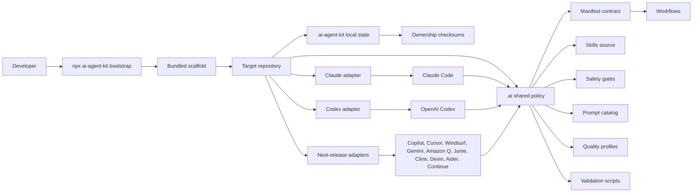

The package owns the scaffold. The target repository receives generated policy and adapters. Developers still review, stage, commit, push, open PRs/MRs, update Jira, and deploy manually.

## Safe Lifecycle and Context Compilation

`update --apply` compares the installed base, project-local content, and
incoming scaffold. Unchanged files update automatically, non-overlapping edits
merge, and overlapping edits preserve local content while emitting base/local/
incoming evidence. Every write is journaled, backed up, path checked, and
rollback-capable.

The task-aware context compiler combines mandatory core policy with
intent-matched rules, profiles, skills, task facts, and approved memory. Its
JSON and Markdown outputs carry provenance, reasons, repository commit, policy
revision, token estimates, exclusions, and a deterministic content hash.
Missing or stale repository intelligence can produce a usable `DEGRADED` pack,
but never a `READY` pack.

## Agent Adapter Model

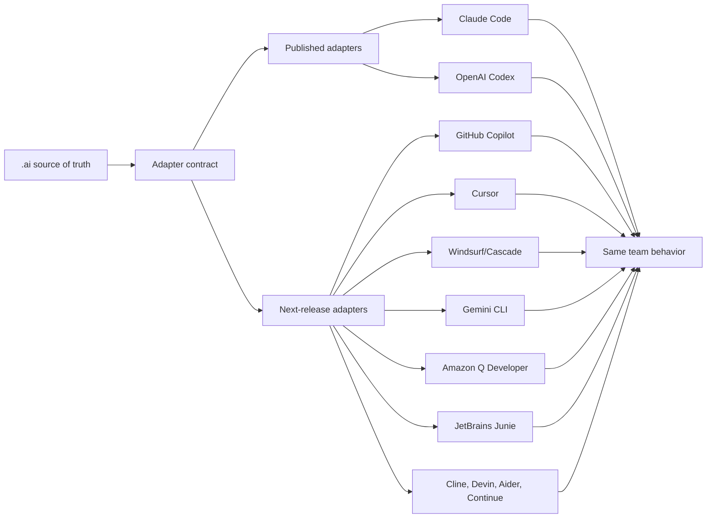

The adapter rule is: route each tool back to `.ai/` instead of copying policy into every platform format. See [Agent Adapter Strategy](AGENT_ADAPTER_STRATEGY.md) for the implemented matrix and release gates.

## Code Quality Intelligence Layer

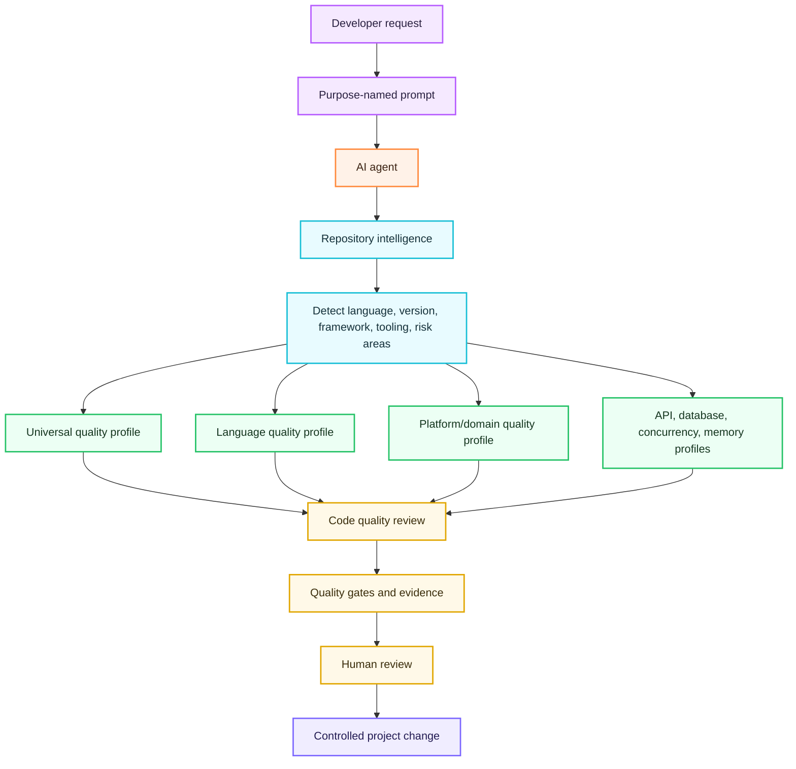

The quality layer is stack-aware but conservative. It prefers repository-defined commands and config, then fills gaps with profile-based manual review. The current bundled profiles cover universal engineering practice, Go, Java, Python, TypeScript/JavaScript, frontend HTML/CSS, web apps, mobile apps, desktop apps, infrastructure, DevOps, API contracts, database work, concurrency, and memory/resource lifecycle.

## Install Impact On A Project

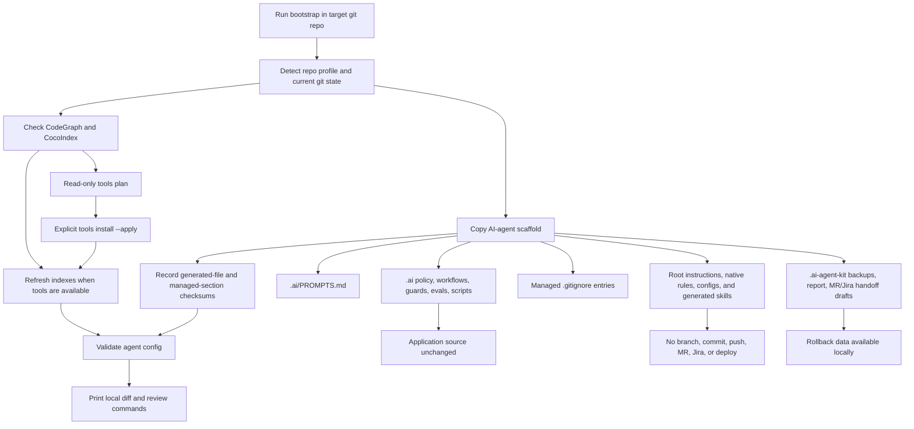

| Installed Area | Purpose | Application Source Impact |
| --- | --- | --- |
| `.ai/` | Shared policy, workflows, prompts, skills, guards, scripts, evals, quality gates, memory governance. | No app source change. |
| Root instruction files | Route agents to the same team policy through `AGENTS.md`, `CLAUDE.md`, `GEMINI.md`, or `CONVENTIONS.md`. | Managed sections only. |
| Adapter directories | Native rules, config, roles, generated skills, hooks, and instructions for selected agents. | No app source change. |
| `.mcp.json` | Local MCP wiring for repository intelligence tools. | No app source change. |
| `.ai-agent-kit/` | Local backups, transaction report, ownership checksums, detected manifests/versions, and copy-ready handoff drafts. | Local metadata only. |
| `.gitignore` | Ignores local AI-agent caches and backup folders. | Managed section only. |

## Prompt-To-Project Workflow

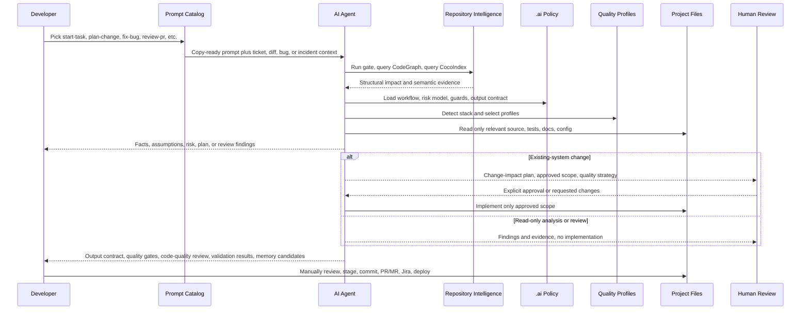

This flow makes the first prompt matter. A developer does not ask the agent to "just fix it"; they choose a prompt whose purpose matches the work. The agent then follows repository intelligence, approval gates, quality gates, and output contracts before the project changes.

## Governance And Feedback Loop

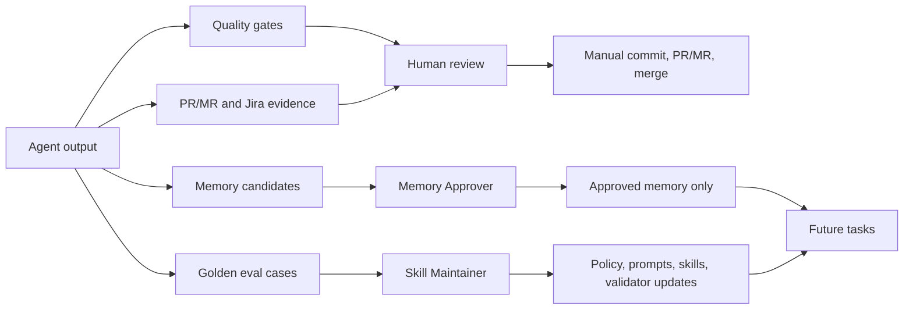

The loop turns good work into reusable team behavior. The memory policy prevents agents from retaining sensitive or speculative information, while golden cases capture reusable failure patterns.

## Governed Runtime Control Plane

Version 0.6 extends the deterministic control plane beneath agent instructions
with execution-bound authorization and a zero-trust MCP broker:

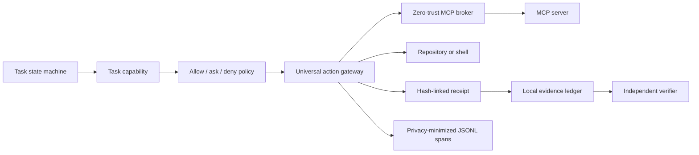

Capabilities bind approval to tools, paths, network domains, risk, expiry,
action budget, repository revision, policy revision, and adapter. The gateway
normalizes and hashes every action, authorizes it immediately before execution,
rejects stale or mismatched decision tokens, and records decision, execution,
and verification receipts with stable reason codes.

The MCP broker is deny-by-default. It binds trust to the exact server
executable and arguments, then constrains tools, filesystem roots, network
domains, timeouts, and rate limits. Changed or untrusted servers cannot
auto-start. Credentials are injected only after authorization and are excluded
from action envelopes, results, receipts, evidence, and telemetry. Offline
checks reject prompt-injection payloads, SSRF targets, token passthrough, and
unsafe local startup patterns.

The control plane deliberately does not autonomously execute protected
production, infrastructure, database, release, Git, or messaging mutations.

Runtime state is stored under ignored `.ai-agent-kit/runtime/`. Evidence contains hashes and decision metadata, not prompts, chain-of-thought, source contents, secrets, or raw command output.

## Final Task Reporting

The final task report is a read model over four local evidence lanes:

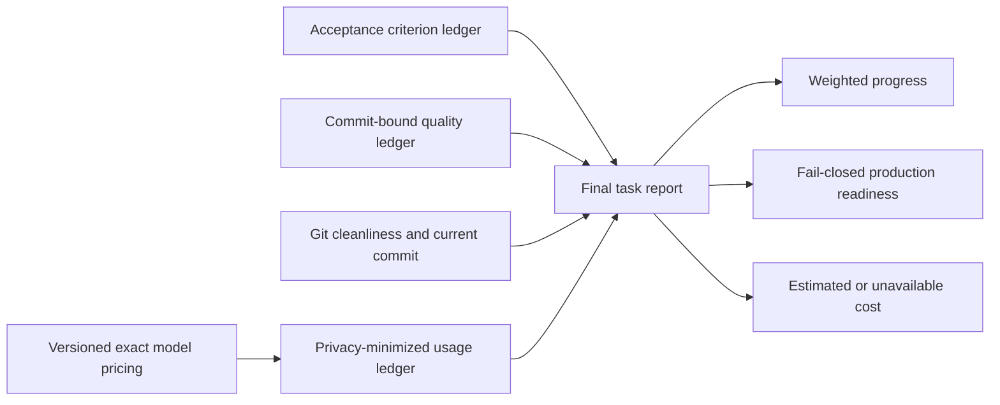

Criterion progress is weight-based and counts only verified applicable
criteria. Quality evidence is stored without raw command output and passing
records become stale when the repository commit changes. Production readiness
requires review-ready task state, verified evidence integrity, 100% verified
criteria, a clean Git worktree, and current evidence for every configured
required gate.

Usage events normalize provider differences without storing prompts,
responses, transcripts, credentials, personal identifiers, or chain-of-thought.
Cumulative session reports use a hashed session identifier and only the latest
counter, preventing stop hooks from double counting. Cost calculation requires
an exact provider/model/effective-date match; subscription fees, credits,
negotiated adjustments, tools, and taxes remain outside the estimate.

## Daily Prompt Names

| Prompt | Purpose |
| --- | --- |
| `start-task` | Understand a new or unclear request before editing. |
| `plan-change` | Produce a change-impact plan and stop before implementation. |
| `implement-approved` | Implement a reviewed and approved scope. |
| `fix-bug` | Find root cause, first incorrect state, and regression coverage. |
| `code-quality-review` | Review code quality using detected stack and selected quality profiles. |
| `review-pr` | Review a diff by production risk, not style preference. |
| `investigate-incident` | Build an incident timeline, impact, evidence, and prevention plan. |
| `prepare-handoff` | Prepare PR/MR, Jira, quality gates, validation, and memory-candidate handoff. |

## Adapter Delivery

Published in `0.5.0`:

- Claude Code
- OpenAI Codex
- GitHub Copilot coding agent
- Cursor
- Windsurf / Devin Desktop Cascade
- Google Gemini CLI / Gemini Code Assist
- Amazon Q Developer
- JetBrains Junie
- Cline
- Devin
- Aider
- Continue

## Why This Matters

Without a shared operating model, every developer invents a different prompt, every agent interprets risk differently, and review evidence becomes inconsistent. AI Agent Kit gives the team a repeatable path from prompt to plan, implementation, review, and learning while keeping the developer in control of source changes and external actions.

## Evidence-driven quality in v0.7.0

Every completed implementation now passes through a final review gate before a
successful handoff. The gate composes the existing code, quality, security, data,
performance, and operations reviews according to risk. It checks the actual diff
against approval, exercises material failure paths, records fixed and unresolved
findings, and blocks `REVIEW_READY` when the review is missing, stale, rejected,
or blocked. The final task report reads this tamper-evident review ledger and
shows reviewed dimensions, corrections, residual risks, and limitations.

The offline evaluation lane replays versioned task fixtures and normalized
Claude Code or Codex trajectories. It evaluates approval, scope, denied
actions, required evidence, outcome, latency, cost, and action budgets before
comparing a candidate with a named baseline. Default CI performs no live model
or production calls.

The PR evidence lane renders the existing task, criterion, quality, Git, and
receipt records as deterministic JSON and concise Markdown. Raw logs remain
outside the primary artifact. A scope mismatch fails instead of becoming a
warning.

The review-quality lane scores labeled findings using explicit denominators,
sample sizes, confidence intervals, noise penalties, and preserved human label
disagreement. More comments do not create a higher score by themselves.

## Portable adapter contract

The canonical adapter registry separates shared behavior from host-specific
surfaces. Bootstrap and update consume the registry; conformance checks verify
the files and skills that each selected adapter claims to support; task
evidence records the adapter's capabilities and limitations.

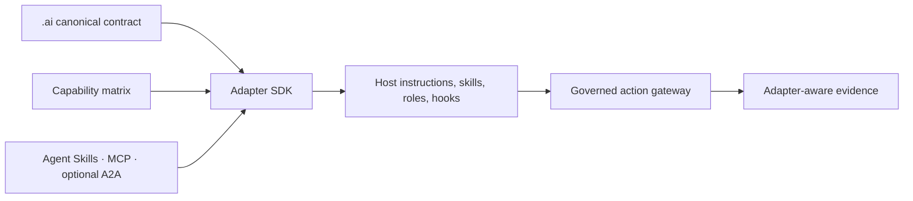

The capability states distinguish native, generated, bridged, advisory,
preview, and unsupported behavior. A2A is a disabled-by-default compatibility
profile for approved remote-agent boundaries, not a dependency of ordinary
single-agent or same-host orchestration.

## Team operations in v0.8.0

Team policy remains Git-native. Signed bundles are resolved from kit defaults
through organization, team, repository, and task layers. Compatibility,
trusted-key authority, duplicate layers, and locked rules fail closed. The
effective result retains per-rule provenance and a deterministic diff.

Outcome analytics store only allowlisted operational facts in a local ledger.
Metric definitions include units, denominators, exclusions, and missing-data
state. Before/after claims remain blocked until both periods have adequate
evidence; export is disabled by default.

Memory lifecycle 2.0 excludes expired, revoked, stale, superseded, and
source-unreachable entries before context compilation. Retrieval is scoped and
deterministic, while the health report exposes lifecycle counts and conflicting
approved knowledge without returning private memory content.

The v1.3.0 implementation draft upgrades that lane to governed shared memory:

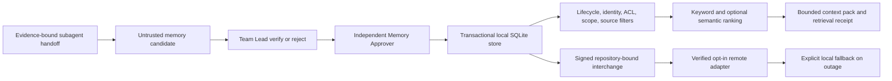

Checked-in policy, host conversation state, task-scoped Team Context, and
durable approved memory remain separate. JSONL becomes deterministic audit and
v2 migration interchange rather than the concurrent writer. Remote capability
claims, writes, encryption, retention, and replay protection are verified at
the adapter boundary; they are not inferred from a host name.

Agent Proof Replay composes these contracts into a redacted proof model. It
uses the same production-readiness evaluation as the final task report and
Change Passport, including acceptance criteria, required quality gates, Git
state, orchestration health, final-review cycles, and evidence integrity. The same model
renders standalone offline HTML, a PR card, a trust badge, and an optional
OpenTelemetry-compatible trace. None of those outputs can grant approval or
change runtime state.

The zero-config demo uses synthetic evidence and performs no model, network,
Git, or application-code action. Its purpose is to make the governed loop
understandable before a team bootstraps the kit into a real repository.

## Change assurance in v0.8.0

Policy Playground evaluates a proposed action against the same task capability
and policy engine used at execution time, but its read-only path does not
consume an action, append a receipt, or return an execution token.

Failure Lab accepts a bounded repository-local manifest of argv arrays. It
never invokes a shell, rejects secret-like injected environment names, requires
explicit execution approval, and stores output hashes rather than raw command
output. A passing report includes a hash over the full normalized result.

Change Passport is the final integrity envelope. A repository-trusted Ed25519
key signs the READY proof hash, repository commit and privacy-minimized worktree
fingerprint, current review and evidence state, and an optional verified
Failure Lab report. Verification checks both signature integrity and signer
trust. Valid signatures from missing or revoked trust entries remain
`VALID_UNTRUSTED`; tampered passports are `REJECTED`.

## Constraint-driven system design

The `design-scalable-systems` skill converts natural-language product and
non-functional requirements into a versioned requirement contract. It keeps
traffic rate, users, connections, in-flight work, latency percentiles,
availability, recovery, consistency, security, and cost as separate measurable
dimensions with source and confidence.

The context compiler selects the skill, system-design profile, and integrity
rule through task-intent matching. The skill inspects repository evidence,
asks at most three architecture-changing questions, and otherwise continues
with explicit low, base, and high scenarios. Detailed references load only for
the dimensions present in the request.

The dependency-free capacity model performs arithmetic for monthly requests,
in-flight concurrency, bandwidth, storage growth, benchmark-backed replica
needs, and sourced cost items. Missing benchmark or pricing evidence remains
`UNAVAILABLE` or `PARTIAL`. It never becomes an invented throughput or zero
cost.

The runtime `architecture` surface validates the contract, calculates capacity,
queries official AWS, Google Cloud, or Azure catalogs through bounded adapters,
and stores hash-verified snapshots under ignored local state. Pricing failure is
degraded evidence, not a design blocker. Benchmark plans require explicit
approval and imported results bind back to the exact request hash.

An architecture build produces JSON evidence plus a script-free offline HTML
view. The artifact binds normalized requirements, the model, decisions,
controls, failure modes, traceability, validation, and repository commit.
Verification rejects tampering and reports repository drift as `STALE`; Agent
Proof includes this result when an artifact exists for the task ID.

Design output compares no more than three stages and selects one recommendation:
smallest viable, target, and extreme scale only when justified. Later stages
require measurable triggers and migration paths. The highest possible design
status is `READY_FOR_REVIEW`; provisioning, paid tests, deployment, and release
remain separate governed actions.

## Agent Department Orchestration

Every task receives a provisional decision at creation and a context-aware
decision after repository inspection. Immediately before dispatch, the planner
reconciles goal, approved paths, facts, assumptions, risk, and evidence. It
selects a solo path, product workcell, bug workcell, or assurance workcell and
adds conditional security, migration, API, performance/concurrency, or design
specialists only when current signals justify them. It always chooses the
smallest team that preserves an independent review.

The workcell contract binds role objectives, dependencies, path ownership,
write access, fan-out, depth, concurrency, retry, time, token, and action
budgets. A single implementation assignment owns writes. Read-only specialists may work in
parallel from one shared repository intelligence brief.

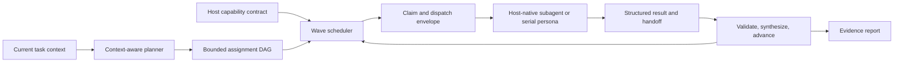

The Team Context Protocol turns that brief into a versioned coordination bus.
Assignments are claimed through bounded leases with heartbeats, publish
immutable structured handoffs, and advance a separate knowledge revision.
Cancellation releases active claims. Resume can retry stale read-only work
within budget, while an orphaned writer blocks for Team Lead review. Optimistic
concurrency rejects lost updates; dependency handoff hashes prevent agents from building on
superseded findings. Claimed write paths cannot overlap or expand approved
scope, and completed work without a matching handoff is not accepted.

Structured findings carry severity, confidence, category, location,
recommendation, and evidence hashes. Deterministic fingerprints collapse exact
duplicates and record confirmations without using majority vote; severity
disagreement remains visible. Conflicting findings remain explicit and block
readiness until the Team Lead records an evidence-bound decision. Handoffs contain facts, findings, risks,
tests, unresolved questions, paths, and source references—not raw conversations,
prompts, secrets, or chain-of-thought. Repository intelligence may be degraded
when optional indexes are unavailable without blocking the workcell.

Planning adapters and execution capabilities are separate contracts. A host
declares bridge kind, native spawn, parallelism, cancellation, structured
results, enforcement, and concurrency. Codex and Claude are unverified and
serial by default; they may use a host-native
bridge; other adapters use the same assignments as serial personas unless they
provide a verified bridge. Repository code never pretends to spawn a host
agent: it invokes an injected host bridge or requires a host-provided external
run identifier before recording native work as running. Cancellation remains
pending until the host confirms it. Assignment results, handoff hashes,
context revisions, external run identifiers, and evidence hashes form a
tamper-evident team contract.

Independent review is a dependency, not an optional persona. Findings reset the
implementation plus downstream QA and assurance assignments, preserving the
result history until fresh verification and a new clean review complete.
Optional specialists can degrade a report but cannot vanish silently. Agent
Proof Replay binds the resulting team hash,
execution mode, assignment status, review independence, and evidence summary.
