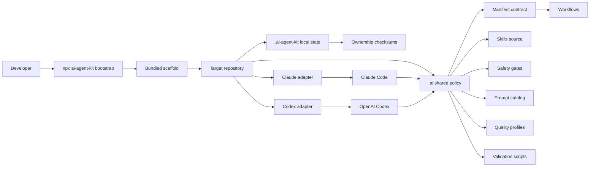
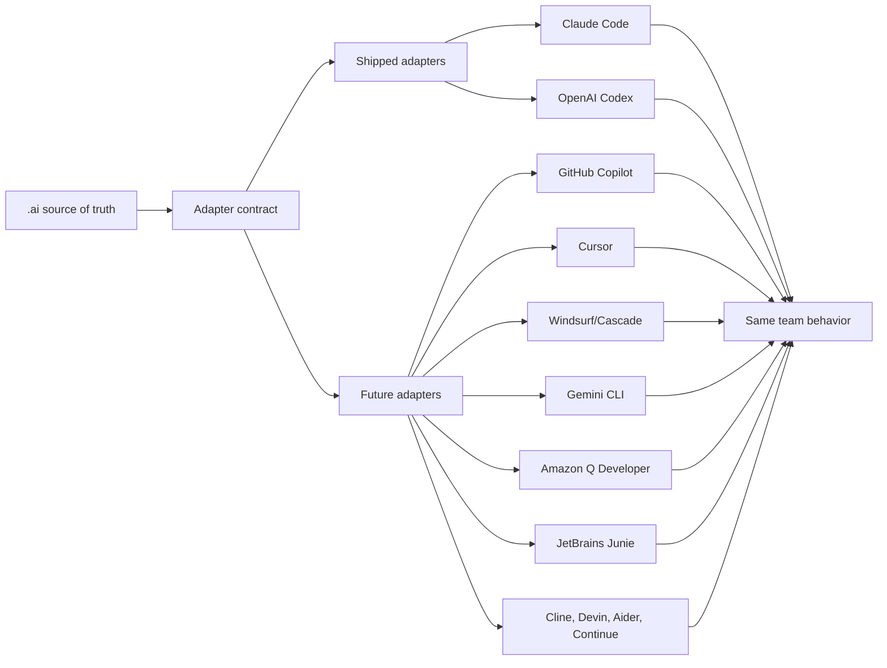
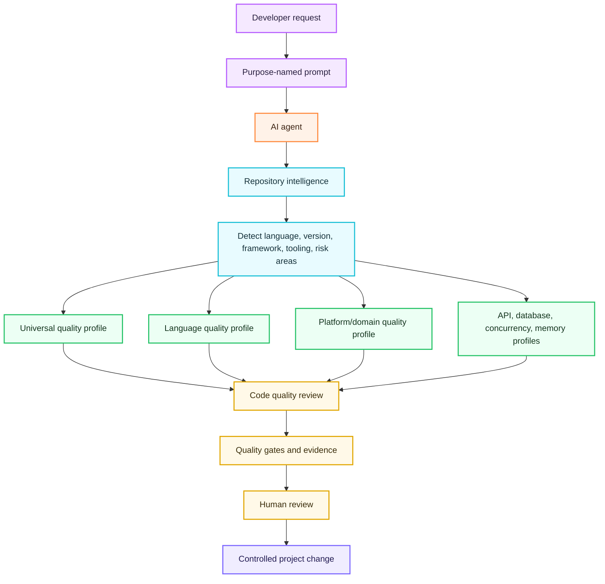
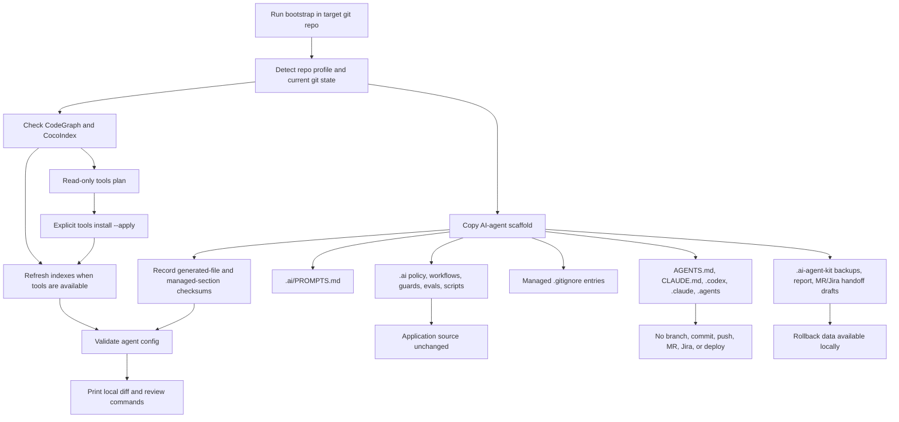
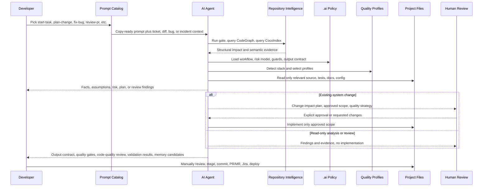
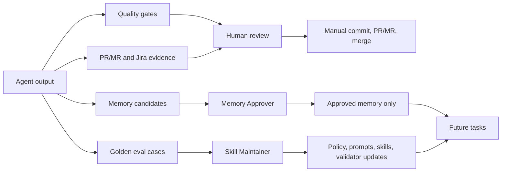

# High-Level Design

AI Agent Kit installs a repository-scoped operating model for AI-assisted engineering. The design goal is simple: developers should start from copy-ready prompts, agents should follow durable team policy, and every output should be reviewable, bounded, and evidence-backed.

## Design Goals

- Make AI-agent setup a one-command local install.
- Give Claude Code and Codex the same repository policy.
- Keep application source code untouched during bootstrap.
- Force repository intelligence before planning, review, QA, documentation analysis, or implementation.
- Apply language/version and platform/domain-aware code-quality profiles before implementation handoff or PR review.
- Stop existing-system changes at a change-impact plan until human approval exists.
- Make output useful for PR/MR review, Jira handoff, QA validation, security review, and future memory governance.

## System Overview

The package owns the scaffold. The target repository receives generated policy and adapters. Developers still review, stage, commit, push, open PRs/MRs, update Jira, and deploy manually.

## Agent Adapter Model

The adapter rule is: route each tool back to `.ai/` instead of copying policy into every platform format. See [Agent Adapter Strategy](AGENT_ADAPTER_STRATEGY.md) for the roadmap.

## Code Quality Intelligence Layer

The quality layer is stack-aware but conservative. It prefers repository-defined commands and config, then fills gaps with profile-based manual review. The current bundled profiles cover universal engineering practice, Go, Java, Python, TypeScript/JavaScript, frontend HTML/CSS, web apps, mobile apps, desktop apps, infrastructure, DevOps, API contracts, database work, concurrency, and memory/resource lifecycle.

## Install Impact On A Project

| Installed Area | Purpose | Application Source Impact |
| --- | --- | --- |
| `.ai/` | Shared policy, workflows, prompts, skills, guards, scripts, evals, quality gates, memory governance. | No app source change. |
| `AGENTS.md` and `CLAUDE.md` | Route Codex and Claude Code to the same team policy. | Managed sections only. |
| `.codex/`, `.claude/`, `.agents/` | Platform adapters, agent roles, generated skills, hooks, and rules. | No app source change. |
| `.mcp.json` | Local MCP wiring for repository intelligence tools. | No app source change. |
| `.ai-agent-kit/` | Local backups, transaction report, ownership checksums, detected manifests/versions, and copy-ready handoff drafts. | Local metadata only. |
| `.gitignore` | Ignores local AI-agent caches and backup folders. | Managed section only. |

## Prompt-To-Project Workflow

This flow makes the first prompt matter. A developer does not ask the agent to "just fix it"; they choose a prompt whose purpose matches the work. The agent then follows repository intelligence, approval gates, quality gates, and output contracts before the project changes.

## Governance And Feedback Loop

The loop turns good work into reusable team behavior. The memory policy prevents agents from retaining sensitive or speculative information, while golden cases capture reusable failure patterns.

## Daily Prompt Names

| Prompt | Purpose |
| --- | --- |
| `start-task` | Understand a new or unclear request before editing. |
| `plan-change` | Produce a change-impact plan and stop before implementation. |
| `implement-approved` | Implement a reviewed and approved scope. |
| `fix-bug` | Find root cause, first incorrect state, and regression coverage. |
| `code-quality-review` | Review code quality using detected stack and selected quality profiles. |
| `review-pr` | Review a diff by production risk, not style preference. |
| `investigate-incident` | Build an incident timeline, impact, evidence, and prevention plan. |
| `prepare-handoff` | Prepare PR/MR, Jira, quality gates, validation, and memory-candidate handoff. |

## Adapter Roadmap

Shipped today:

- Claude Code
- OpenAI Codex

Adapter-ready targets:

- GitHub Copilot coding agent
- Cursor
- Windsurf / Devin Desktop Cascade
- Google Gemini CLI / Gemini Code Assist
- Amazon Q Developer
- JetBrains Junie
- Cline
- Devin
- Aider
- Continue

## Why This Matters

Without a shared operating model, every developer invents a different prompt, every agent interprets risk differently, and review evidence becomes inconsistent. AI Agent Kit gives the team a repeatable path from prompt to plan, implementation, review, and learning while keeping the developer in control of source changes and external actions.
