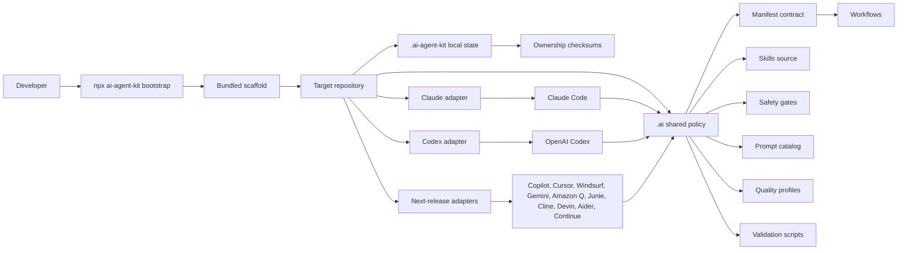
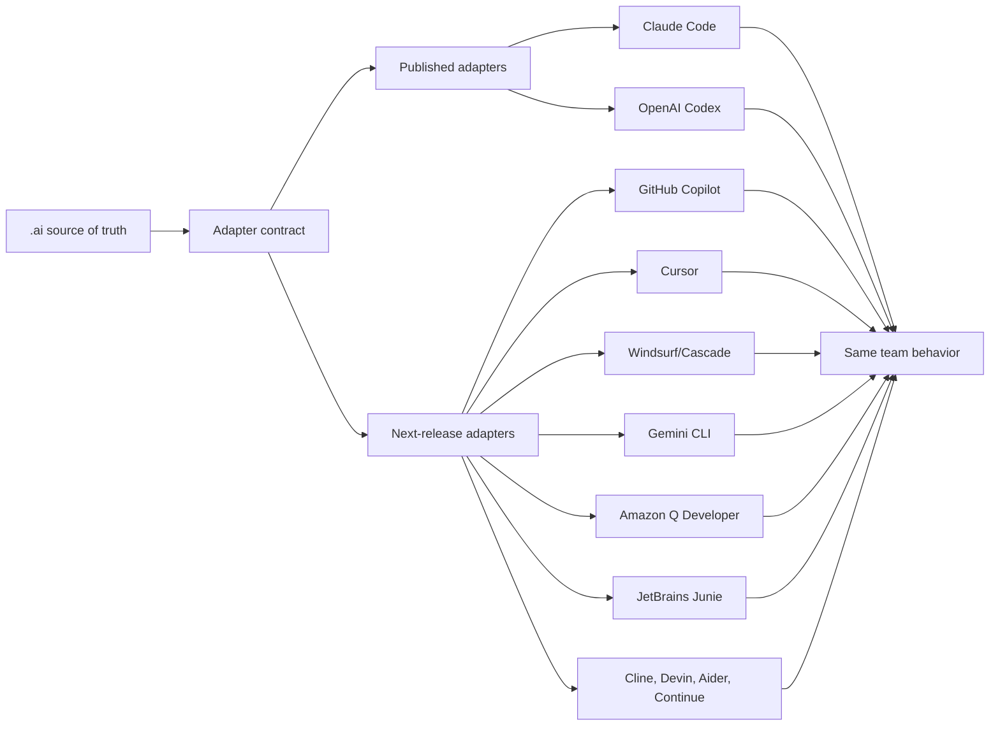
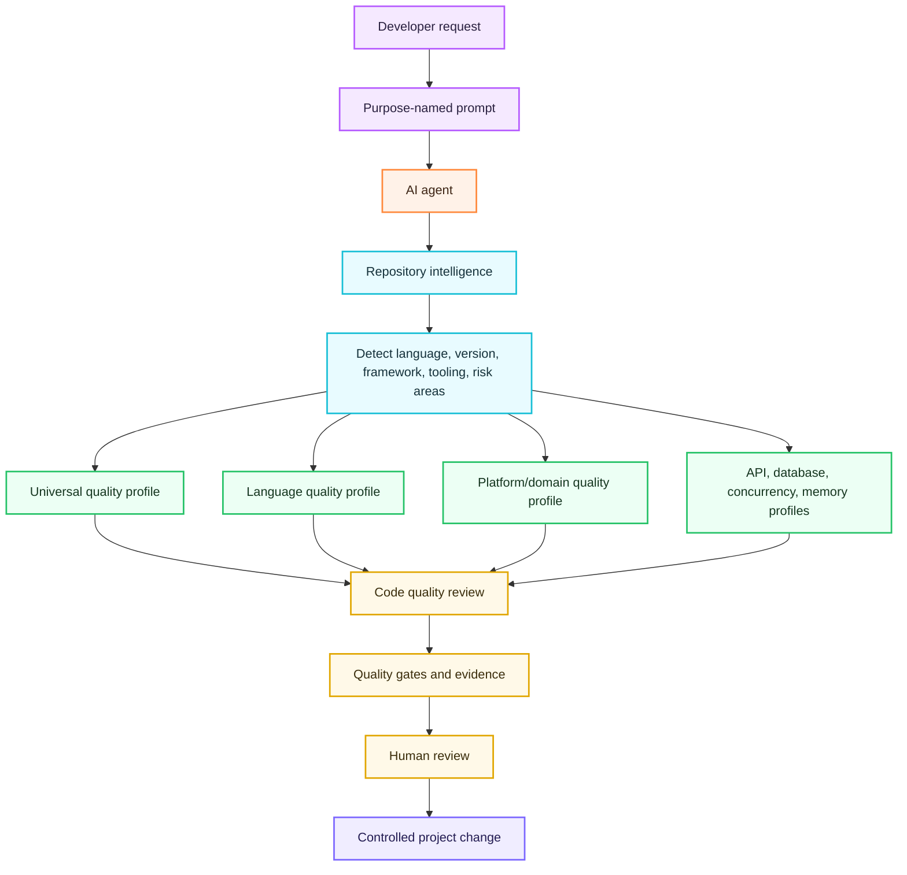
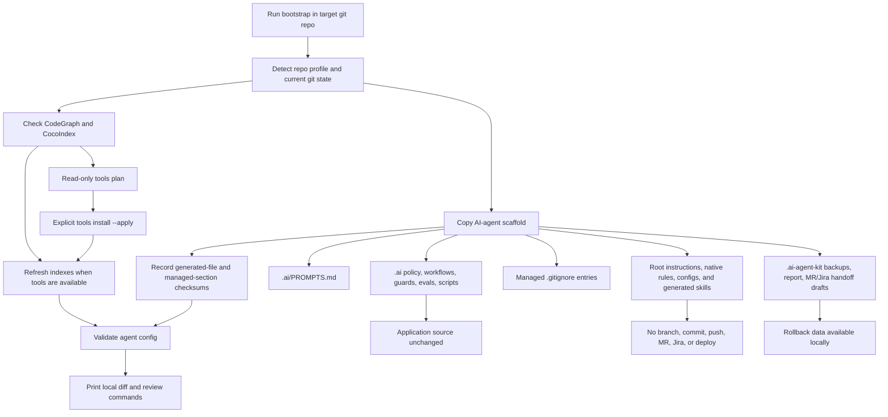
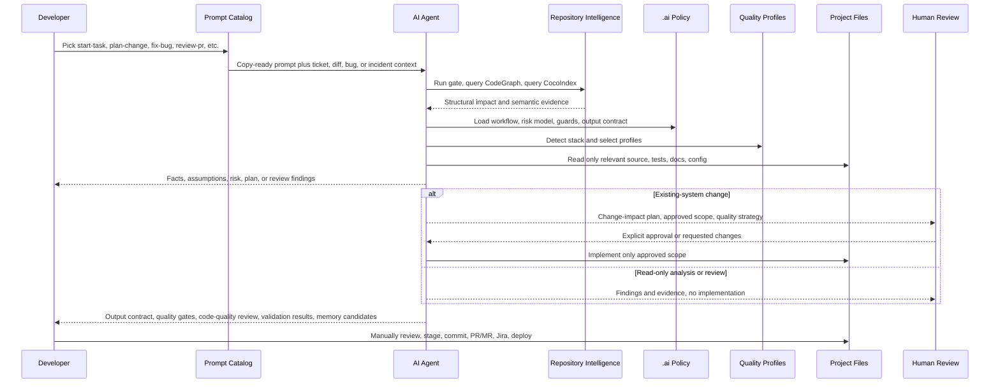
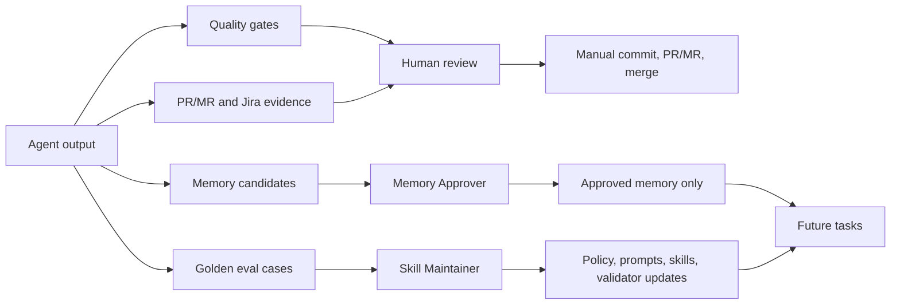
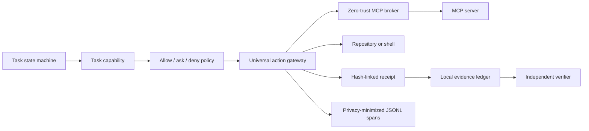
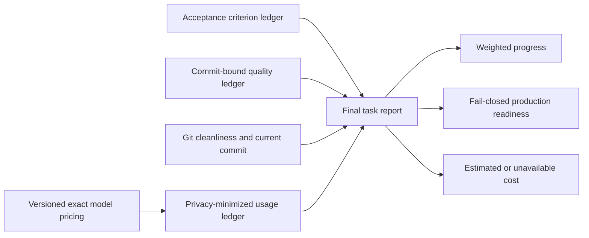

# High-Level Design

AI Agent Kit installs a repository-scoped operating model for AI-assisted engineering. The design goal is simple: developers should start from copy-ready prompts, agents should follow durable team policy, and every output should be reviewable, bounded, and evidence-backed.

## Design Goals

- Make AI-agent setup a one-command local install.
- Give supported AI coding agents the same repository policy.
- Keep application source code untouched during bootstrap.
- Force repository intelligence before planning, review, QA, documentation analysis, or implementation.
- Apply language/version and platform/domain-aware code-quality profiles before implementation handoff or PR review.
- Stop existing-system changes at a change-impact plan until human approval exists.
- Make output useful for PR/MR review, Jira handoff, QA validation, security review, and future memory governance.

## System Overview

The package owns the scaffold. The target repository receives generated policy and adapters. Developers still review, stage, commit, push, open PRs/MRs, update Jira, and deploy manually.

## Safe Lifecycle and Context Compilation

`update --apply` compares the installed base, project-local content, and
incoming scaffold. Unchanged files update automatically, non-overlapping edits
merge, and overlapping edits preserve local content while emitting base/local/
incoming evidence. Every write is journaled, backed up, path checked, and
rollback-capable.

The task-aware context compiler combines mandatory core policy with
intent-matched rules, profiles, skills, task facts, and approved memory. Its
JSON and Markdown outputs carry provenance, reasons, repository commit, policy
revision, token estimates, exclusions, and a deterministic content hash.
Missing or stale repository intelligence can produce a usable `DEGRADED` pack,
but never a `READY` pack.

## Agent Adapter Model

The adapter rule is: route each tool back to `.ai/` instead of copying policy into every platform format. See [Agent Adapter Strategy](AGENT_ADAPTER_STRATEGY.md) for the implemented matrix and release gates.

## Code Quality Intelligence Layer

The quality layer is stack-aware but conservative. It prefers repository-defined commands and config, then fills gaps with profile-based manual review. The current bundled profiles cover universal engineering practice, Go, Java, Python, TypeScript/JavaScript, frontend HTML/CSS, web apps, mobile apps, desktop apps, infrastructure, DevOps, API contracts, database work, concurrency, and memory/resource lifecycle.

## Install Impact On A Project

| Installed Area | Purpose | Application Source Impact |
| --- | --- | --- |
| `.ai/` | Shared policy, workflows, prompts, skills, guards, scripts, evals, quality gates, memory governance. | No app source change. |
| Root instruction files | Route agents to the same team policy through `AGENTS.md`, `CLAUDE.md`, `GEMINI.md`, or `CONVENTIONS.md`. | Managed sections only. |
| Adapter directories | Native rules, config, roles, generated skills, hooks, and instructions for selected agents. | No app source change. |
| `.mcp.json` | Local MCP wiring for repository intelligence tools. | No app source change. |
| `.ai-agent-kit/` | Local backups, transaction report, ownership checksums, detected manifests/versions, and copy-ready handoff drafts. | Local metadata only. |
| `.gitignore` | Ignores local AI-agent caches and backup folders. | Managed section only. |

## Prompt-To-Project Workflow

This flow makes the first prompt matter. A developer does not ask the agent to "just fix it"; they choose a prompt whose purpose matches the work. The agent then follows repository intelligence, approval gates, quality gates, and output contracts before the project changes.

## Governance And Feedback Loop

The loop turns good work into reusable team behavior. The memory policy prevents agents from retaining sensitive or speculative information, while golden cases capture reusable failure patterns.

## Governed Runtime Control Plane

Version 0.6 extends the deterministic control plane beneath agent instructions
with execution-bound authorization and a zero-trust MCP broker:

Capabilities bind approval to tools, paths, network domains, risk, expiry,
action budget, repository revision, policy revision, and adapter. The gateway
normalizes and hashes every action, authorizes it immediately before execution,
rejects stale or mismatched decision tokens, and records decision, execution,
and verification receipts with stable reason codes.

The MCP broker is deny-by-default. It binds trust to the exact server
executable and arguments, then constrains tools, filesystem roots, network
domains, timeouts, and rate limits. Changed or untrusted servers cannot
auto-start. Credentials are injected only after authorization and are excluded
from action envelopes, results, receipts, evidence, and telemetry. Offline
checks reject prompt-injection payloads, SSRF targets, token passthrough, and
unsafe local startup patterns.

The control plane deliberately does not autonomously execute protected
production, infrastructure, database, release, Git, or messaging mutations.

Runtime state is stored under ignored `.ai-agent-kit/runtime/`. Evidence contains hashes and decision metadata, not prompts, chain-of-thought, source contents, secrets, or raw command output.

## Final Task Reporting

The final task report is a read model over four local evidence lanes:

Criterion progress is weight-based and counts only verified applicable
criteria. Quality evidence is stored without raw command output and passing
records become stale when the repository commit changes. Production readiness
requires review-ready task state, verified evidence integrity, 100% verified
criteria, a clean Git worktree, and current evidence for every configured
required gate.

Usage events normalize provider differences without storing prompts,
responses, transcripts, credentials, personal identifiers, or chain-of-thought.
Cumulative session reports use a hashed session identifier and only the latest
counter, preventing stop hooks from double counting. Cost calculation requires
an exact provider/model/effective-date match; subscription fees, credits,
negotiated adjustments, tools, and taxes remain outside the estimate.

## Daily Prompt Names

| Prompt | Purpose |
| --- | --- |
| `start-task` | Understand a new or unclear request before editing. |
| `plan-change` | Produce a change-impact plan and stop before implementation. |
| `implement-approved` | Implement a reviewed and approved scope. |
| `fix-bug` | Find root cause, first incorrect state, and regression coverage. |
| `code-quality-review` | Review code quality using detected stack and selected quality profiles. |
| `review-pr` | Review a diff by production risk, not style preference. |
| `investigate-incident` | Build an incident timeline, impact, evidence, and prevention plan. |
| `prepare-handoff` | Prepare PR/MR, Jira, quality gates, validation, and memory-candidate handoff. |

## Adapter Delivery

Published in `0.5.0`:

- Claude Code
- OpenAI Codex
- GitHub Copilot coding agent
- Cursor
- Windsurf / Devin Desktop Cascade
- Google Gemini CLI / Gemini Code Assist
- Amazon Q Developer
- JetBrains Junie
- Cline
- Devin
- Aider
- Continue

## Why This Matters

Without a shared operating model, every developer invents a different prompt, every agent interprets risk differently, and review evidence becomes inconsistent. AI Agent Kit gives the team a repeatable path from prompt to plan, implementation, review, and learning while keeping the developer in control of source changes and external actions.
